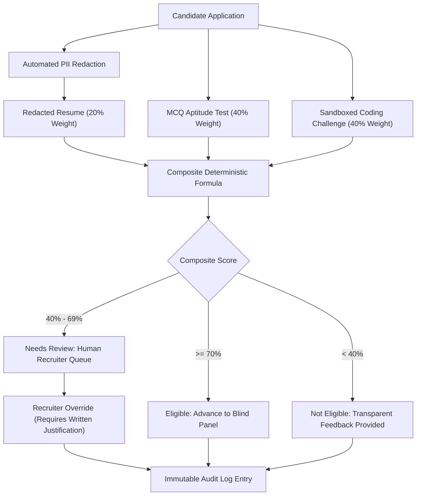

# FairHire — AI-Powered Hiring Bias Detector & Demographic-Neutral Recruitment Platform

> **FairHire** is an enterprise-grade, full-stack recruitment platform engineered to eradicate conscious and unconscious bias across the talent acquisition lifecycle. By replacing subjective keyword screening and demographic markers with automated PII redaction, sandboxed technical challenges, and transparent scoring formulas, FairHire ensures every candidate is evaluated strictly on merit.

---

## 📑 Table of Contents

1. [Platform Overview & Philosophy](#-platform-overview--philosophy)
2. [High-Level Architecture](#-high-level-architecture)
3. [Technology Stack](#-technology-stack)
4. [Complete Feature Matrix](#-complete-feature-matrix)
5. [User Portals & User Journeys](#-user-portals--user-journeys)
6. [Algorithmic Fairness & Scoring Engine](#-algorithmic-fairness--scoring-engine)
7. [Database Models & Schemas](#-database-models--schemas)
8. [API Reference & WebSocket Specs](#-api-reference--websocket-specs)
9. [Regulatory Compliance (NYC LL144 & EEOC)](#-regulatory-compliance-nyc-ll144--eeoc)
10. [Directory Structure](#-directory-structure)
11. [Installation & Local Setup](#-installation--local-setup)
12. [Testing & Verification](#-testing--verification)
13. [Environment Configuration](#-environment-configuration)

---

## 💡 Platform Overview & Philosophy

Traditional recruitment algorithms inadvertently perpetuate demographic bias by training on historical hiring data, filtering resumes based on pedigree or zip codes, and relying on ambiguous "culture fit" metrics.

**FairHire solves this with four core pillars:**
1. **Zero PII Exposure (Blind Screening):** Candidate names, genders, profile pictures, graduation years, phone numbers, and addresses are algorithmically redacted before evaluators access applications.
2. **Transparent, Deterministic Scoring:** No black-box AI scores. Overall candidate ranking follows an auditable, deterministic formula:
   $$\text{Composite Score} = (\text{MCQ Aptitude} \times 0.40) + (\text{Coding Sandbox} \times 0.40) + (\text{Resume Match} \times 0.20)$$
3. **Inclusive Language Enforcement:** Job descriptions are dynamically analyzed as recruiters type, detecting masculine-coded, ageist, or exclusionary terminology with one-click neutral substitutions.
4. **Immutable Audit Trails:** Every screening, evaluation, status change, and human override generates an immutable log entry compliant with **NYC Local Law 144** and **EEOC 4/5ths Uniform Guidelines**.

---

## 🏛️ High-Level Architecture

```
                                  ┌────────────────────────────────────────────────────────┐
                                  │                  Browser Client (UI)                   │
                                  │  React 18 • Vite • Lucide Icons • Responsive Layouts   │
                                  └──────────────┬──────────────────────────┬──────────────┘
                                                 │ HTTP Requests            │ WebSocket (ws://)
                                                 ▼                          ▼
                                  ┌────────────────────────────────────────────────────────┐
                                  │               Express 4 REST / WS Server               │
                                  │                  Node.js Port :5000                    │
                                  │   Auth (JWT) • Rate Limiting • Audit Logs • Jobs API   │
                                  └──────────────┬──────────────────────────┬──────────────┘
                                                 │                          │
                         Sequelize ORM / SQLite  │                          │ HTTP Proxy / AI Tasks
                                                 ▼                          ▼
                                  ┌───────────────────────┐  ┌─────────────────────────────┐
                                  │   Relational Store    │  │    FastAPI AI Microservice  │
                                  │  SQLite / PostgreSQL  │  │         Python :8000         │
                                  │ 11 Tables • Auditing  │  │ Bias Scan • Test Gen • Code │
                                  └───────────────────────┘  └─────────────────────────────┘
```

---

## 🛠️ Technology Stack

| Layer | Technology | Version | Purpose |
|---|---|---|---|
| **Frontend** | React, Vite | `18.2` / `5.4` | Modern SPA with fast HMR and client-side routing |
| **Icons & Design** | Lucide React | `^0.344` | Vector iconography and cohesive design system |
| **Routing** | React Router DOM | `^6.22` | Declarative role-based routing and protected guards |
| **Backend API** | Node.js, Express | `v20+` / `4.19` | RESTful API, authentication middleware, rate limiting |
| **ORM / Data** | Sequelize, SQLite3 | `6.37` / `5.1` | Local zero-dependency database with Postgres compatibility |
| **Real-Time** | WebSocket (`ws`) | `^8.16` | Live sub-second JD bias scoring while typing |
| **File Parsing** | `pdf-parse`, Multer | `^1.1` | Secure resume upload and raw text extraction |
| **AI Microservice** | Python, FastAPI | `3.11` / `0.110` | NLP bias scanning, rubric generation, and test grading |
| **Code Execution** | Node `vm` sandbox | Built-in | Isolated execution of JavaScript coding test submissions |

---

## ⚡ Complete Feature Matrix

### 1. Public & Onboarding Ecosystem
* **Landing Page (`/`):** Hero showcase with transparent glassmorphic navigation, live interactive bias demo, 5-stage candidate journey overview, and ethical pillars.
* **Authentication Suite (`/login`, `/register`, `/forgot-password`, `/reset-password`):** Split-screen layout featuring high-tech AI holographic visuals, strict password strength meter, email verification, and RBAC redirection.
* **Employer Access Intake (`/employer-request`):** Corporate domain verification, consumer email blocker (`@gmail`, `@yahoo`, etc.), company size/volume intake, and platform compliance toggles.

### 2. Recruiter Workspace (`/recruiter/*`)
* **Dashboard (`/recruiter/dashboard`):** Real-time KPI summary (active positions, pending reviews, de-biased candidate pool count, average bias score).
* **Job Management & Post Role (`/recruiter/jobs`, `/recruiter/jobs/new`):**
  - Form fields for role level, compensation transparency, department, and skills.
  - **Inline Inclusive Language Checker:** 18 categorized bias rules detecting gender-coded terms, age bias, and exclusionary phrasing.
  - **One-Click Fix:** Instant Wand tool (`fixAll`) to replace flagged words with neutral alternatives.
  - **Save as Draft & Publish:** Syncs with backend database and issues unique reference IDs (`FH-XXXXXX`).
* **Blind Candidate Pool (`/recruiter/candidates`, `/recruiter/review`):**
  - Evaluates anonymized candidate records (`Candidate #001`, `CAND-A92B`).
  - View component scores (MCQ, Coding Sandbox, Skill Evidence) without demographic visibility.
  - Advance, hold, or reject applicants with mandatory audit justification notes.
* **Technical Assessment Results (`/recruiter/test-results/:testId`):** Inspection of automated test submissions, pass/fail test case metrics, and execution times.
* **Interview Scheduler (`/recruiter/interviews`):** Demographic-neutral interview coordination.
* **Compliance Audit Trail (`/recruiter/audit`):** Immutable log of every recruiter action, candidate status change, and system assessment.

### 3. Candidate Experience Portal (`/candidate/*`)
* **Applicant Dashboard (`/candidate/dashboard`, `/candidate/status`):** Visual 5-step milestone progress tracker:
  1. *Resume Uploaded & Anonymized*
  2. *Domain & Skill Selection*
  3. *MCQ Aptitude Assessment*
  4. *Sandboxed Coding Challenge*
  5. *Objective Results & Recruiter Review*
* **Resume Anonymizer (`/candidate/resume-upload`, `/candidate/redaction-review`):** Upload PDF/DOCX resumes, view identified PII markers (email, phone, address, gender cues), and review the redacted version before submission.
* **Domain Selection (`/candidate/domain-selection`):** Select technical track (Full-Stack, Backend, Frontend, Data Engineering, DevOps).
* **Timed MCQ Assessment (`/candidate/assessment`, `/candidate/take-test`):** 30-minute auto-timed technical questions with question navigator dot-matrix and review flags.
* **Interactive Coding Sandbox (`/candidate/coding-sandbox`):** In-browser Monaco-style code editor with test runner, execution timer, and unit test verification.
* **Transparent Results Page (`/candidate/results`):** Complete formula breakdown displaying MCQ Score (40%), Coding Sandbox (40%), and Resume Match (20%) alongside rubric explanations.
* **Interviews & Applications (`/candidate/applications`, `/candidate/interviews`):** Status tracking and technical interview calendar.

### 4. Administrator & Governance Console (`/admin/*`)
* **System Dashboard (`/admin/dashboard`):** Platform-wide metrics, active candidate count, recruiter requests pending review.
* **Audit Explorer (`/admin/audit`):** Advanced log explorer with action filters, date range selection, formatted JSON payloads, and one-click CSV export.
* **Enterprise Billing (`/admin/billing`):** Tier management (Starter, Growth, Enterprise) and seat allocation.

---

## 🔄 Algorithmic Fairness & Scoring Engine



### 1. Inclusive Language Detection Engine
Analyzes job descriptions using regex pattern matching and semantic classification:
* **Masculine / Hyper-Competitive:** `ninja` $\rightarrow$ *expert*, `rockstar` $\rightarrow$ *high performer*, `aggressive` $\rightarrow$ *proactive*, `dominant` $\rightarrow$ *influential*.
* **Age Bias:** `digital native` $\rightarrow$ *comfortable with digital tools*, `young` $\rightarrow$ *early-career*, `recent graduate` $\rightarrow$ *entry-level applicant*.
* **Sameness & Exclusionary:** `culture fit` $\rightarrow$ *values alignment*, `work hard play hard` $\rightarrow$ *healthy balance*.

### 2. Candidate Evaluation Formula
Candidate assessment scores are deterministic and immutable:
$$\text{Composite} = \text{round}\left((\text{MCQ} \times 0.40) + (\text{Coding} \times 0.40) + (\text{ResumeMatch} \times 0.20)\right)$$
* **MCQ Score (0–100):** Percentage of correct technical questions validated server-side.
* **Coding Score (0–100):** Percentage of passing unit test assertions executed in an isolated VM sandbox.
* **Resume Match Score (0–100):** Overlap between candidate verified technical skills and job requirements.

---

## 🗄️ Database Models & Schemas

The application uses Sequelize ORM with relational mapping. Primary models include:

| Model | Table Name | Key Attributes | Description |
|---|---|---|---|
| **User** | `users` | `id`, `email`, `passwordHash`, `firstName`, `lastName`, `role`, `isActive` | User credentials and RBAC roles (`candidate`, `recruiter`, `hr_lead`, `admin`) |
| **Job** | `jobs` | `id`, `title`, `rawText`, `department`, `level`, `workMode`, `location`, `salaryMin`, `salaryMax`, `skills`, `biasScore`, `status` | Job postings with bias metrics and fairness toggles |
| **Application** | `applications` | `id`, `jobId`, `candidateId`, `anonymousAlias`, `status`, `recruiterNotes` | Tracks candidate job applications under an anonymous alias |
| **CandidateResume**| `candidate_resumes` | `id`, `userId`, `refId`, `fileName`, `redactedText`, `detectedMarkersJson`, `extractedSkillsJson` | Stores anonymized resume text and redacted PII marker logs |
| **AptitudeTest** | `aptitude_tests` | `id`, `applicationId`, `domainId`, `questionsJson`, `mcqScore`, `codingScore`, `compositeScore`, `status` | Contains test questions, answer submissions, and component scores |
| **TestSubmission** | `test_submissions` | `id`, `testId`, `answersJson`, `autoScore`, `breakdown`, `submittedAt` | Raw candidate MCQ responses and code execution outputs |
| **AuditLog** | `audit_logs` | `id`, `userId`, `action`, `entityType`, `entityId`, `reason`, `meta` | Immutable event logs for legal compliance and process traceability |
| **RecruiterRequest**| `recruiter_requests`| `id`, `companyName`, `workEmail`, `companySize`, `useCase`, `status`, `inviteToken` | Corporate access intake and verification records |
| **Interview** | `interviews` | `id`, `applicationId`, `candidateId`, `recruiterId`, `scheduledAt`, `meetingLink`, `status` | Technical interview schedules |
| **Notification** | `notifications` | `id`, `userId`, `type`, `title`, `message`, `read`, `link` | Real-time user alert and status notifications |

---

## 🌐 API Reference & WebSocket Specs

### Authentication (`/api/auth`)
* `POST /register`: Candidate public registration.
* `POST /login`: Issues 7-day signed JWT for all roles.
* `GET /me`: Returns current user profile and role.

### Jobs (`/api/jobs`)
* `GET /`: Lists all published job postings (public).
* `GET /my`: Lists all jobs authored by the authenticated recruiter.
* `GET /:id`: Retrieves full details of a specific job posting.
* `POST /`: Creates a new job draft or published posting.
* `PUT /:id`: Updates job details, skills, or compensation.
* `PATCH /:id/publish`: Publishes a draft after bias scanning.

### Employer Access (`/api/employers`)
* `POST /request-access`: Submits enterprise recruiter access requests with corporate domain verification.

### Resumes & Redaction (`/api/resume`)
* `POST /upload`: Uploads and parses PDF/DOCX, strips PII, and returns masked text.
* `GET /profile`: Retrieves the candidate's anonymized profile.
* `POST /confirm`: Candidate confirms redaction accuracy.

### Assessments & Sandboxing (`/api/assessment`)
* `POST /start`: Initializes an assessment and returns questions without answer keys.
* `POST /:id/code-run`: Executes code in an isolated Node `vm` sandbox against test cases.
* `POST /:id/submit`: Grades MCQ and coding solutions, calculates composite score.

### Compliance Audits (`/api/audit`)
* `GET /events`: Admin endpoint to query filterable audit trail logs.
* `GET /export`: Streams audit logs formatted as downloadable CSV.

### Live Bias WebSocket (`ws://localhost:5000/ws/bias-score`)
* **Message In:** `{"type": "score", "text": "Job description contents..."}`
* **Message Out:** `{"type": "score_update", "score": 88, "flag_count": 2}`

---

## 📜 Regulatory Compliance (NYC LL144 & EEOC)

FairHire is built specifically to satisfy employment compliance mandates:

1. **NYC Local Law 144 (Automated Employment Decision Tools):**
   - Independent annual bias audit readiness.
   - Continuous impact ratio computation across protected demographic groups.
   - 10-day advance notice and opt-out transparency for job applicants.
2. **EEOC Uniform Guidelines on Employee Selection Procedures (UGESP):**
   - **80% (Four-Fifths) Adverse Impact Rule:** Automated reporting flags any selection rate that falls below 80% of the highest selection rate group.
   - Strict job-relatedness validation through skill rubrics and coding benchmarks.
3. **Data Privacy & Redaction Governance:**
   - Personally Identifiable Information (PII) is isolated from evaluators.
   - Raw resumes are never indexed into generative LLMs without consent.

---

## 📂 Directory Structure

```
AI-Hiring-Bias-Detector/
├── Backend/
│   ├── src/
│   │   ├── config/
│   │   │   └── db.js               # Database connection (SQLite / Postgres)
│   │   ├── middleware/
│   │   │   ├── auth.js             # JWT verification & RBAC guard
│   │   │   └── rateLimiter.js      # Express rate limiters
│   │   ├── models/
│   │   │   └── index.js            # Sequelize models & schema definitions
│   │   ├── routes/
│   │   │   ├── auth.js             # User login & registration
│   │   │   ├── jobs.js             # Job posting, updates & list
│   │   │   ├── employers.js        # Enterprise request intake
│   │   │   ├── resume.js           # Upload & PII stripping
│   │   │   ├── assessment.js       # MCQ & coding sandbox runner
│   │   │   ├── recruiter.js        # Candidate review & scoring
│   │   │   └── audit.js            # Compliance logs & CSV export
│   │   ├── services/
│   │   │   ├── biasDetectionService.js
│   │   │   └── anonymizationService.js
│   │   └── index.js                # Express & WebSocket server bootstrap
│   └── package.json
│
├── Frontend/
│   ├── public/
│   │   ├── ai-candidate-assistant.jpg # Auth pages visual artwork
│   │   ├── enterprise-hiring-ai.jpg   # Enterprise boardroom visual artwork
│   │   └── interview-hero-bg.jpg      # Landing hero visual
│   ├── src/
│   │   ├── components/             # Reusable UI widgets (Ring, Panels, ErrorBoundary)
│   │   ├── context/
│   │   │   └── AuthContext.jsx     # Global authentication & user state
│   │   ├── layouts/
│   │   │   ├── RecruiterLayout.jsx # Recruiter portal shell & navigation
│   │   │   ├── CandidateLayout.jsx # Candidate portal shell & navigation
│   │   │   └── AdminLayout.jsx     # Admin console shell & navigation
│   │   ├── pages/
│   │   │   ├── Landing.jsx         # Modern landing page with live demo
│   │   │   ├── Login.jsx           # High-tech auth screen
│   │   │   ├── EmployerRequest.jsx # Corporate access intake with live validation
│   │   │   ├── recruiter/
│   │   │   │   ├── Dashboard.jsx   # Recruiter KPI dashboard
│   │   │   │   ├── Jobs.jsx        # Job description list
│   │   │   │   ├── JobCreate.jsx   # Post role with 18 bias rules & tags
│   │   │   │   └── Candidates.jsx  # Blind candidate review queue
│   │   │   └── candidate/
│   │   │       ├── Dashboard.jsx   # 5-step applicant status tracker
│   │   │       ├── ResumeUpload.jsx# Resume parsing & PII preview
│   │   │       ├── Assessment.jsx  # Timed technical challenge
│   │   │       └── CodingSandbox.jsx # Live in-browser coding runner
│   │   ├── App.jsx                 # Route declarations & role guards
│   │   └── main.jsx                # React DOM entrypoint
│   └── package.json
│
├── AI_Service/                     # Python FastAPI microservice (optional)
│   ├── app/
│   │   ├── bias_scanner.py         # Advanced NLP token analyzer
│   │   └── test_generator.py       # Assessment question generator
│   └── main.py
│
├── PROJECT.md                      # Comprehensive Master Documentation (This file)
├── README.md                       # Quickstart summary
└── dev.sqlite                      # Local development SQLite database
```

---

## 🚀 Installation & Local Setup

### Prerequisites
* **Node.js:** v18.0.0 or higher
* **npm:** v9.0.0 or higher
* **Python (Optional):** v3.11+ (only for extended AI microservice)

### Step 1: Clone Repository
```bash
git clone https://github.com/pateladil910/AI-Hiring-Bias-Detector.git
cd AI-Hiring-Bias-Detector
```

### Step 2: Install Backend Dependencies
```bash
cd Backend
npm install
```

### Step 3: Install Frontend Dependencies
```bash
cd ../Frontend
npm install
```

### Step 4: Run the Development Servers

Open two terminal windows:

* **Terminal 1: Start Backend Server (Port 5000)**
  ```bash
  cd Backend
  npm run dev
  ```
  *(Database auto-creates as `dev.sqlite` with all tables and columns synced).*

* **Terminal 2: Start Frontend Application (Port 5173)**
  ```bash
  cd Frontend
  npm run dev
  ```

Visit **`http://localhost:5173`** in your browser.

---

## 🧪 Testing & Demo Credentials

Pre-seeded demonstration accounts for development testing:

| Role | Email | Password | Access Level |
|---|---|---|---|
| **Recruiter** | `recruiter@fairhire.io` | `password123` | Full access to post jobs, review blind candidates, and view audits |
| **Candidate** | `candidate@fairhire.io` | `password123` | Upload resume, take assessments, view scoring breakdown |
| **Admin** | `admin@fairhire.io` | `password123` | Global system analytics, compliance audit export, and billing |

### Verify Production Build
```bash
cd Frontend
npm run build
```
*(Confirms clean bundle transformation with 0 compilation errors).*

---

## 🔒 Security & Data Governance

* **Password Security:** Salted and hashed using `bcryptjs` (cost factor 10).
* **JWT Tokens:** Authenticated with `HS256` signatures and strict 7-day expiration.
* **Rate Limiting:** IP-based throttles preventing brute-force login attempts and upload spam.
* **Code Sandboxing:** Sandboxed code execution in Node's built-in `vm` module with strict memory limits and a 3000ms execution timeout to guard against infinite loops.
* **XSS & Content Security:** Strict React DOM escaping and sanitized markdown rendering.

---

## 📄 License & Attribution

Copyright © 2026 FairHire AI Technologies Inc. Distributed under the MIT License. Developed for algorithmic demographic neutrality and audit-grade recruitment transparency.
