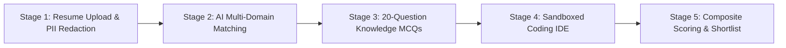
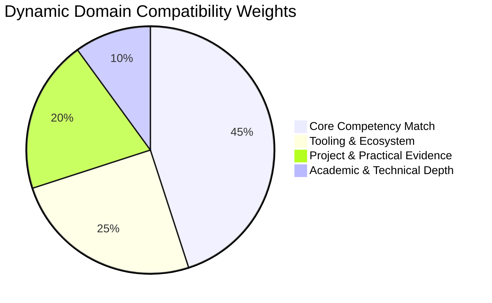
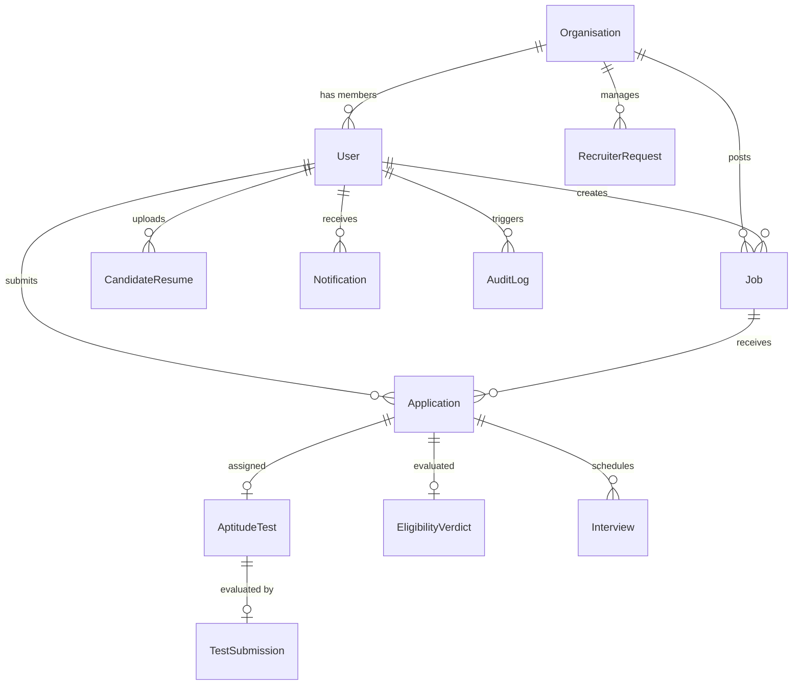

# FairHire — AI-Powered Hiring Bias Detector & Demographic-Neutral Recruitment Platform

> **FairHire** is an enterprise-grade recruitment and assessment platform engineered to eradicate conscious and unconscious bias across the talent acquisition lifecycle. By replacing subjective keyword screening and demographic markers with automated PII redaction, deep dynamic AI resume intelligence, sandboxed technical challenges, and auditable mathematical scoring formulas, FairHire ensures every candidate is evaluated strictly on demonstrated merit.

---

## 📑 Table of Contents

1. [Platform Overview & Philosophy](#-platform-overview--philosophy)
2. [High-Level Architecture](#-high-level-architecture)
3. [Technology Stack](#-technology-stack)
4. [Complete Feature Matrix](#-complete-feature-matrix)
5. [Candidate 5-Stage Journey & Workflow](#-candidate-5-stage-journey--workflow)
6. [Dynamic AI Resume Intelligence Engine](#-dynamic-ai-resume-intelligence-engine)
7. [Algorithmic Assessments & Sandboxed IDE](#-algorithmic-assessments--sandboxed-ide)
8. [Transparent Mathematical Scoring & EEOC Compliance](#-transparent-mathematical-scoring--eeoc-compliance)
9. [Recruiter & Admin Workspaces](#-recruiter--admin-workspaces)
10. [Database Schema & Models](#-database-schema--models)
11. [Complete REST API & WebSocket Reference](#-complete-rest-api--websocket-reference)
12. [Directory Structure](#-directory-structure)
13. [Installation & Local Setup](#-installation--local-setup)
14. [Testing & Demo Credentials](#-testing--demo-credentials)
15. [Security & Data Governance](#-security--data-governance)

---

## 💡 Platform Overview & Philosophy

Traditional recruitment workflows and keyword parsers inadvertently perpetuate demographic bias. Resume screeners often penalize non-traditional backgrounds, reward prestige brand names or zip codes, and evaluate applicants through opaque black-box algorithms.

### FairHire Solves This with Four Core Principles:

1. **Zero PII Exposure (Blind Screening):** Candidate names, genders, profile pictures, graduation years, phone numbers, and street addresses are algorithmically stripped and replaced with deterministic tokens (`[REDACTED_NAME]`, `[REDACTED_PHONE]`, `[REDACTED_EMAIL]`) and anonymous cryptographic aliases (`CAND-XXXXXX`).
2. **Transparent, Deterministic Scoring (No Black Boxes):** Overall ranking follows an auditable, deterministic formula:
   $$\text{Composite Score} = (\text{MCQ Aptitude} \times 0.40) + (\text{Coding Sandbox} \times 0.40) + (\text{Resume Match} \times 0.20)$$
3. **Deep Dynamic AI Profiling (No Static Checklists):** Resumes are dynamically analyzed across 4 weighted pillars (Core Skills, Tooling Ecosystem, Practical Project Evidence, and Academic/Honors Foundations) to generate tailored compatibility scores across engineering tracks.
4. **Inclusive Language Enforcement & Auditability:** Job descriptions are dynamically analyzed as recruiters type, detecting masculine-coded, ageist, or exclusionary terminology with one-click neutral substitutions. Every screening decision, evaluation, and recruiter action generates an immutable audit record compliant with **NYC Local Law 144** and **EEOC 4/5ths Uniform Guidelines**.

---

## 🏛️ High-Level Architecture

```
                                  ┌────────────────────────────────────────────────────────┐
                                  │                  Browser Client (UI)                   │
                                  │   React 18 • Vite • TailwindCSS • Lucide Iconography   │
                                  └──────────────┬──────────────────────────┬──────────────┘
                                                 │ HTTP Requests            │ WebSocket (ws://)
                                                 ▼                          ▼
                                  ┌────────────────────────────────────────────────────────┐
                                  │               Express 4 REST / WS Server               │
                                  │                  Node.js Port :5000                    │
                                  │  Auth (JWT) • Rate Limiting • Audit Logs • Assessments │
                                  │  Dynamic AI Resume Analyzer • Sandboxed VM Execution   │
                                  └──────────────┬──────────────────────────┬──────────────┘
                                                 │                          │
                         Sequelize ORM / SQLite  │                          │ HTTP Proxy / Extended AI
                                                 ▼                          ▼
                                  ┌───────────────────────┐  ┌─────────────────────────────┐
                                  │   Relational Store    │  │   FastAPI AI Microservice   │
                                  │  SQLite / PostgreSQL  │  │        Python :8000         │
                                  │ 11 Tables • Auditing  │  │ Hybrid Bias Scan • Spacy PII│
                                  └───────────────────────┘  └─────────────────────────────┘
```

---

## 🛠️ Technology Stack

| Layer | Technology | Version | Purpose |
|---|---|---|---|
| **Frontend Framework** | React, Vite | `18.2` / `5.4` | Single Page Application with instantaneous HMR and responsive design |
| **Icons & Design** | Lucide React | `^0.344` | Cohesive modern vector iconography |
| **Routing** | React Router DOM | `^6.22` | Declarative, role-based client-side routing with authentication guards |
| **Backend API Server** | Node.js, Express | `v20+` / `4.21` | RESTful API, security middleware (Helmet, Rate-Limiting), JWT auth |
| **Database & ORM** | Sequelize, SQLite3 | `6.37` / `5.1` | Zero-dependency local persistence with full PostgreSQL compatibility |
| **Real-Time Streaming** | WebSocket (`ws`) | `^8.21` | Sub-second live JD bias scoring while recruiters type |
| **Resume & PDF Parsing** | `pdf-parse` (v1 & v2 class), Multer | `^2.4` / `1.4` | Universal PDF text extraction, boundary-safe regex, and buffer parsing |
| **Sandboxed Code VM** | Node.js `vm` Module | Built-in | Isolated execution context for JavaScript code challenges (no process/fs access) |
| **AI Microservice (Optional)** | Python, FastAPI | `3.11` / `0.110` | Spacy PII identification, lexicon bias scanning, and Claude LLM layers |

---

## ⚡ Complete Feature Matrix

### 1. Public & Onboarding Ecosystem
* **Landing Page (`/`):** Full-display showcase with live interactive bias scanner demo, 5-stage candidate journey walkthrough, and regulatory compliance standards.
* **Authentication Suite (`/login`, `/register`, `/forgot-password`, `/reset-password`):** Split-screen layout featuring password security meters, email verification, and role-based redirection.
* **Employer Intake (`/employer-request`):** Corporate email verification (blocks public webmail domains), volume intake, and compliance onboarding.

### 2. Candidate Workspace (`/candidate/*`)
* **Strict Stage 1 Resume Gating:** Enforces resume upload and verification before candidate can access domain tracks, assessments, or job applications.
* **Resume Anonymization Review (`/candidate/resume/review`):** Displays demographic markers stripped alongside the recruiter's anonymized view.
* **AI Multi-Domain Intelligence Card:** Real-time compatibility evaluation showing match percentages, verified skill chips, and project portfolio citations across Full Stack, AI/ML, and Frontend tracks.
* **Domain Selection (`/candidate/domain`):** Recommends the highest-fitting engineering specialization with dynamic AI Match badges (`⚡ AI Match: 99% - 🌟 Best Match`).
* **Timed Assessment Portal (`/candidate/assessment/:id`):** 20 domain-specific MCQs (1 min per question with live countdown timer and autosave).
* **Sandboxed Coding IDE (`/candidate/coding-sandbox`):** Integrated code editor with starter stubs, sample test cases, a 20-minute sandbox timer, and instantaneous unit test execution inside an isolated VM.
* **Verified Assessment Scorecard (`/candidate/results/:id`):** Full breakdown of MCQ, Coding, and Resume Match scores, mathematical formula explanation, and standardized readiness tiers.
* **Application & Interview Trackers (`/candidate/applications`, `/candidate/interviews`):** Status tracking, recruiter feedback, and virtual meeting coordination.

### 3. Recruiter Workspace (`/recruiter/*`)
* **Recruiter Dashboard (`/recruiter/dashboard`):** Real-time metrics on open requisitions, anonymized applicants, and average bias scores.
* **Inclusive Job Creator (`/recruiter/jobs/new`):** Live WebSocket bias checker detecting gender-coded or exclusionary phrases with a one-click Wand tool for neutral substitutions.
* **Blind Candidate Review (`/recruiter/review`):** Candidate inspection evaluating purely on code output, MCQ performance, and anonymized skill profiles.
* **Technical Submissions Inspector (`/recruiter/test-results/:testId`):** View submitted source code, test cases passed, and algorithmic efficiency.
* **Audit Trail (`/recruiter/audit`):** Immutable log of every recruiter action, candidate status change, and system assessment.

### 4. Admin Portal (`/admin/*`)
* **System Status & Health (`/admin/system`):** Real-time health monitors for Node.js backend, SQLite database, WebSocket server, and AI microservice.
* **Compliance Management (`/admin/compliance`):** EEOC compliance audits, adverse impact ratio calculators, and CSV export.

---

## 🚀 Candidate 5-Stage Journey & Workflow


```mermaid
flowchart LR
    A["Stage 1: Resume Upload & PII Redaction"] --> B["Stage 2: AI Multi-Domain Matching"]
    B --> C["Stage 3: 20-Question Knowledge MCQs"]
    C --> D["Stage 4: Sandboxed Coding IDE"]
    D --> E["Stage 5: Composite Scoring & Shortlist"]
```

1. **Stage 1: Upload & Redaction:** Candidate uploads resume (PDF/DOCX). PII is automatically scrubbed, generating cloaked alias `CAND-XXXXXX`.
2. **Stage 2: AI Domain Alignment:** AI parses technical skills, hands-on projects, work history, and academic background to compute match scores for each domain track.
3. **Stage 3: Knowledge Assessment:** Candidate tackles 20 randomized questions designed to assess foundational domain understanding under a 20-minute server countdown.
4. **Stage 4: Algorithmic Sandbox:** Candidate implements an algorithmic challenge in an isolated VM IDE (20-minute timer). Test cases run against the solution in real-time.
5. **Stage 5: Scorecard & Blind Review:** Candidate receives an objective score out of 100. Recruiters review verified code and scores without demographic indicators.

---

## 🧠 Dynamic AI Resume Intelligence Engine

The platform incorporates an advanced, domain-aware AI Resume Analyzer ([`aiResumeAnalyzer.js`](file:///e:/SE/AI-Hiring-Bias-Detector/Backend/src/services/aiResumeAnalyzer.js)) that calculates compatibility dynamically based on four weighted pillars:


```mermaid
pie title Dynamic Domain Compatibility Weights
    "Core Competency Match" : 45
    "Tooling & Ecosystem" : 25
    "Project & Practical Evidence" : 20
    "Academic & Technical Depth" : 10
```

### The 4 Pillars of Evaluation:

1. **Core Competencies (45% Weight):** Evaluates coverage of the primary domain languages and core frameworks (e.g. React, Node.js, REST APIs, Python, NLP).
2. **Tooling & Ecosystem (25% Weight):** Assesses supporting technologies including databases (SQL/NoSQL), state management, version control (Git), build tooling, and cloud services.
3. **Hands-On Project Evidence (20% Weight):** Scans the project portfolio and work history for real-world implementation (e.g., streaming telemetry dashboards, NLP intent engines, anomaly detection pipelines).
4. **Academic & Technical Foundation (10% Weight):** Considers relevant engineering degrees, CPI/GPA, hackathon awards, and technical certifications.

### Dynamic Scoring Tiers:
* **🌟 Best Match (90–100%):** Exceptional alignment across core skills, tooling, and practical projects.
* **✅ Strong Fit (78–89%):** High proficiency meeting all foundational criteria with verified projects.
* **👍 Suitable Fit (60–77%):** Meets baseline requirements with minor skill gaps.
* **⚠️ Needs Upskilling (<60%):** Noticeable gaps in domain tools; personalized upskilling recommended.

---

## 💻 Algorithmic Assessments & Sandboxed IDE

Each engineering domain features a tailored assessment track:

| Domain Track | Time Limits | Format | Coding Problem |
|---|---|---|---|
| **Full Stack Engineering** | 20 min MCQs + 20 min Code | 20 MCQs (1 min/Q) + 1 Coding Challenge | `isValid(s)` — Valid Parentheses & Bracket Matching |
| **Frontend Architecture** | 20 min MCQs + 20 min Code | 20 MCQs (1 min/Q) + 1 Coding Challenge | `flatten(arr)` — Deep Array Flattening with Depth Limit |
| **Artificial Intelligence & ML** | 20 min MCQs + 20 min Code | 20 MCQs (1 min/Q) + 1 Coding Challenge | `cosineSimilarity(vecA, vecB)` — Vector Embedding Similarity |

### Isolated VM Sandbox Architecture:
* Runs inside Node's native `vm` module.
* Execution context is stripped of `process`, `fs`, `require`, and network sockets.
* Hard timeout of **3,000ms** per test case to terminate infinite loops or memory bombs.
* Returns structured pass/fail results, actual vs. expected outputs, and execution logs.

---

## ⚖️ Transparent Mathematical Scoring & EEOC Compliance

The overall candidate assessment is governed by a transparent weighted formula:

$$\mathbf{Composite\ Score} = (\text{MCQ} \times 0.40) + (\text{Coding} \times 0.40) + (\text{Resume\ Match} \times 0.20)$$

### Example Calculation:
A candidate scores **85% on MCQs**, **80% on Coding**, and achieves **95% on Resume Match**:
$$\text{Composite} = (85 \times 0.40) + (80 \times 0.40) + (95 \times 0.20) = 34.0 + 32.0 + 19.0 = \mathbf{85.0\ /\ 100}$$

### Standardized Readiness Tiers:
* **Tier 1 • Exceptional Mastery (85–100 pts):** Top-tier algorithmic execution and verified background depth. Recommended for **Direct Fast-Track Onsite Interview**.
* **Tier 2 • Interview Ready (70–84 pts):** Core passing threshold demonstrating functional algorithmic ability and domain proficiency. Recommended for **Technical Screening Interview**.
* **Tier 3 • Developing / Borderline (50–69 pts):** Partial aptitude or test case completion. Candidate held for recruiter review or re-testing.
* **Tier 4 • Below Benchmark (<50 pts):** Submission lacks working code or verified aptitude answers. Candidate encouraged to upskill.

---

## 🗄️ Database Schema & Models

The system uses Sequelize ORM with 11 relational tables:


```mermaid
erDiagram
    Organisation ||--o{ User : "has members"
    Organisation ||--o{ Job : "posts"
    Organisation ||--o{ RecruiterRequest : "manages"
    User ||--o{ Job : "creates"
    User ||--o{ Application : "submits"
    User ||--o{ CandidateResume : "uploads"
    User ||--o{ Notification : "receives"
    User ||--o{ AuditLog : "triggers"
    Job ||--o{ Application : "receives"
    Application ||--o| AptitudeTest : "assigned"
    Application ||--o| EligibilityVerdict : "evaluated"
    Application ||--o{ Interview : "schedules"
    AptitudeTest ||--o| TestSubmission : "evaluated by"
```

1. **`organisations`**: Corporate entity records, status (`active`, `suspended`), and domain verification.
2. **`users`**: User authentication records with roles (`admin`, `hr_lead`, `recruiter`, `compliance`, `candidate`).
3. **`jobs`**: Job postings, department, compensation, required skills, and bias scores.
4. **`candidate_resumes`**: Anonymized resumes, extracted skills JSON, detected PII markers JSON, `aiAnalysisJson`, and consent timestamps.
5. **`applications`**: Candidate applications linked to jobs, masked aliases, and statuses (`applied`, `test_completed`, `eligible`, `interview`, `hired`).
6. **`aptitude_tests`**: Domain test instances, question bank JSON, scores (`mcqScore`, `codingScore`, `compositeScore`), and scoring formulas.
7. **`test_submissions`**: Raw candidate answers, auto scores, and VM execution breakdowns.
8. **`eligibility_verdicts`**: Objective shortlist verdicts (`eligible`, `not_eligible`, `needs_review`) and override logs.
9. **`interviews`**: Demographic-neutral interview records with scheduled dates and Google Meet links.
10. **`notifications`**: User alerts for assessment invites, status updates, and compliance reminders.
11. **`audit_logs`**: Immutable compliance records tracking every action, user ID, entity ID, and timestamp.

---

## 🔌 Complete REST API & WebSocket Reference

### Authentication & Profiles
* `POST /api/auth/register` — Register new user account.
* `POST /api/auth/login` — Authenticate and issue JWT.
* `GET /api/auth/me` — Retrieve active user session and role.

### Resume & AI Profiling
* `POST /api/resume/upload` — Upload resume (PDF/DOCX), redact PII, and run deep AI analysis.
* `GET /api/resume/my` — Fetch candidate's active confirmed resume and AI profile.
* `GET /api/resume/domain-matches` — Retrieve dynamic compatibility scores across all domains.
* `POST /api/resume/confirm/:refId` — Confirm demographic-neutral profile and lock for evaluation.

### Assessments & Testing
* `GET /api/assessment/domains` — Catalog of available assessment tracks.
* `POST /api/assessment/start` — Launch timed assessment session for chosen domain.
* `GET /api/assessment/:id` — Retrieve sanitized question bank and coding challenge.
* `PUT /api/assessment/:id/answers` — Autosave MCQ answers periodically.
* `POST /api/assessment/:id/code-run` — Execute code inside sandboxed VM against test cases.
* `POST /api/assessment/:id/submit` — Final evaluation, composite scoring, and verdict generation.
* `GET /api/assessment/results/:id` — Detailed scorecard, subscores, and AI project citations.

### Recruiter & Jobs
* `GET /api/jobs` — Retrieve published job listings.
* `POST /api/jobs` — Create new job requisition with bias scan metadata.
* `GET /api/recruiter/candidates` — Retrieve anonymized candidate pool.
* `POST /api/recruiter/applications/:id/status` — Advance candidate stage with mandatory audit note.

### Real-Time WebSocket
* `ws://localhost:5000/ws/bias-score` — Connects live keystroke stream for instant JD bias checking.

---

## 📁 Directory Structure

```
AI-Hiring-Bias-Detector/
├── Backend/                            # Node.js Express REST & WebSocket API
│   ├── src/
│   │   ├── config/                     # Database connection & Sequelize instance
│   │   ├── data/                       # 20-MCQ question banks & coding challenges
│   │   ├── middleware/                 # JWT authentication & RBAC guards
│   │   ├── models/                     # Sequelize models (11 relational schemas)
│   │   ├── routes/                     # REST route controllers (assessment, resume, auth, jobs)
│   │   ├── services/                   # Dynamic AI resume analyzer & bias services
│   │   ├── websocket/                  # Live WebSocket server for JD bias scanning
│   │   └── index.js                    # Express app bootstrap & HTTP/WS server
│   ├── package.json
│   └── .env
│
├── Frontend/                           # React 18 Single Page Application
│   ├── src/
│   │   ├── components/                 # Reusable UI widgets, modals, and navbars
│   │   ├── layouts/                    # Candidate, Recruiter, Admin, and Public layouts
│   │   ├── pages/
│   │   │   ├── candidate/              # Resume upload, domain selector, IDE, and scorecards
│   │   │   ├── recruiter/              # Job creator, blind review, and test results
│   │   │   ├── admin/                  # System status, compliance, and user tables
│   │   │   └── auth/                   # Login, register, and employer request
│   │   ├── App.jsx                     # Route definitions & protected route guards
│   │   └── main.jsx                    # Application entrypoint & styles
│   ├── package.json
│   └── vite.config.js
│
├── ai-service/                         # Python FastAPI Microservice (Optional)
│   ├── services/                       # NLP bias detector & Spacy PII anonymizer
│   ├── main.py                         # FastAPI routes & Swagger documentation
│   └── requirements.txt
│
├── PROJECT.md                          # Full Project Documentation (This file)
├── README.md                           # Quickstart guide
└── dev.sqlite                          # Local development SQLite database
```

---

## 🚀 Installation & Local Setup

### Prerequisites
* **Node.js:** v18.0.0 or higher
* **npm:** v9.0.0 or higher
* **Python (Optional):** v3.11+ (only for extended AI microservice)

### Step 1: Clone Repository
```bash
git clone https://github.com/pateladil910/AI-Hiring-Bias-Detector.git
cd AI-Hiring-Bias-Detector
```

### Step 2: Install Backend Dependencies
```bash
cd Backend
npm install
```

### Step 3: Install Frontend Dependencies
```bash
cd ../Frontend
npm install
```

### Step 4: Run the Development Servers

Open two terminal windows:

* **Terminal 1: Start Backend Server (Port 5000)**
  ```bash
  cd Backend
  npm run dev
  ```
  *(Database auto-creates as `dev.sqlite` with all tables and columns synced).*

* **Terminal 2: Start Frontend Application (Port 5173)**
  ```bash
  cd Frontend
  npm run dev
  ```

Visit **`http://localhost:5173`** in your browser.

---

## 🧪 Testing & Demo Credentials

Pre-seeded demonstration accounts for development testing:

| Role | Email | Password | Access Level |
|---|---|---|---|
| **Recruiter** | `recruiter@fairhire.io` | `password123` | Full access to post jobs, review blind candidates, and view audits |
| **Candidate** | `candidate@fairhire.io` | `password123` | Upload resume, take assessments, view scoring breakdown |
| **Admin** | `admin@fairhire.io` | `password123` | Global system analytics, compliance audit export, and billing |

### Verify Production Build
```bash
cd Frontend
npm run build
```
*(Confirms clean bundle transformation with 0 compilation errors).*

---

## 🔒 Security & Data Governance

* **Password Security:** Salted and hashed using `bcryptjs` (cost factor 10).
* **JWT Tokens:** Authenticated with `HS256` signatures and strict 7-day expiration.
* **Rate Limiting:** IP-based throttles preventing brute-force login attempts and upload spam.
* **Code Sandboxing:** Sandboxed code execution in Node's built-in `vm` module with strict memory limits and a 3000ms execution timeout to guard against infinite loops.
* **XSS & Content Security:** Strict React DOM escaping and sanitized markdown rendering.

---

## 📄 License & Attribution

Copyright © 2026 FairHire AI Technologies Inc. Distributed under the MIT License. Developed for algorithmic demographic neutrality and audit-grade recruitment transparency.
