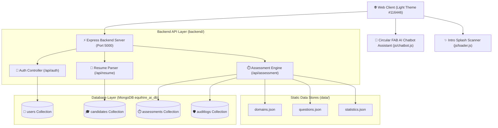
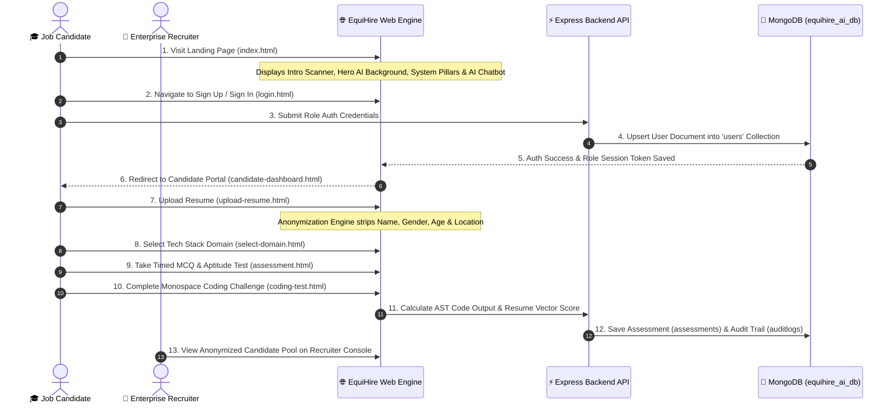

# EquiHire AI — Demographic-Blind AI Hiring & Bias Detection Platform
> **Enterprise Production Documentation** | Version 2.4.0  
> *Architected for Demographic Neutrality, AST Skill Vectoring, and Verifiable EEOC Compliance.*

---

## 📋 Executive Overview & Mission Statement

**EquiHire AI** is an enterprise-grade AI Hiring Bias Detection and Candidate Assessment Platform. Traditional recruitment pipelines frequently suffer from unconscious human bias, rejecting top-tier engineering talent based on name origin, gender pronouns, age markers, geographic location, or university brand prestige.

EquiHire AI addresses this challenge by introducing an automated, multi-tiered demographic cloaking shield combined with deterministic technical evaluation sandboxes:
1. **Demographic Anonymization**: Automatically strips candidate names, gender, age, photo, location, and university prestige prior to evaluator access.
2. **Domain Skill Vectoring**: Maps technical proficiencies and project depth against calibrated job stack requirements.
3. **Monospace AST Code Sandbox**: Evaluates code correctness and $O(1)$ time/space algorithmic efficiency in a timed browser sandbox.
4. **Verifiable EEOC Audit Trail**: Audits test questions for linguistic neutrality and generates tamper-proof compliance logs for legal standards (EEOC & GDPR).

---

## 🏗️ Master System Architecture Diagram



---

## 📂 Complete Project Directory Structure

```
AI-Hiring-Bias-Detector/
├── PROJECT_DOCUMENTATION.md   # Complete Master Project Documentation File
├── index.html                 # Hero, System Pillars, Live Bias Meter, Tech Domains, FAQ
├── about.html                 # Mission Statement & EEOC Methodology Timeline
├── features.html              # Enterprise Capabilities & Bias Mitigation Suite
├── upload-resume.html         # Step 1: Candidate Resume Upload & Anonymization
├── select-domain.html         # Step 2: Calibrated Tech Domain Selection (10 Stack Options)
├── assessment.html            # Step 3: Timed MCQ & Aptitude Section (20:00 Timer)
├── coding-test.html           # Step 4: Monospace AST Coding Sandbox & Test Case Runner
├── resume-analysis.html       # Step 5: Parsed Skill Matrix & Gap Analysis
├── bias-report.html           # Step 6: Real-Time EEOC Bias Audit & Neutrality Gauge
├── final-score.html           # Step 7: Composite Merit Score & Hiring Verdict
├── recruiter-dashboard.html   # Enterprise Recruiter Console & Candidate Pool Table
├── candidate-dashboard.html   # Candidate Application Status & Merit Score Tracking
├── login.html                 # Multi-User Role Authentication (Candidate, Recruiter, Admin)
├── signup.html                # Account Registration with Privacy Guarantees
├── contact.html               # Enterprise Sales & EEOC Audit Support
│
├── css/                       # Design System & Styling Tokens
│   ├── variables.css          # Core #116446 Light Theme Tokens & Color Palette
│   ├── global.css             # Resets, Buttons, Cards, Inputs, & Floating Circular FAB
│   ├── navbar.css             # Transparent Glassmorphic Header Navigation
│   ├── footer.css             # Footer Grid & Compliance Copyright
│   ├── animations.css         # Keyframes for Pulse Shield, Intro Scanner & Slides
│   ├── index.css              # Hero Section AI Background Photo Frame & Stats Grid
│   ├── upload.css             # Upload Drop Zone & Progress Fill Bar
│   ├── assessment.css         # Timed MCQ Card & Option Selection Rows
│   ├── coding.css             # Monospace Code Editor & Console Output Panel
│   ├── bias-report.css        # SVG Neutrality Gauge & EEOC Audit Metric Rows
│   ├── dashboard.css          # Recruiter Data Table & Metric Cards Grid
│   └── responsive.css         # Mobile & Tablet Layout Breakpoints
│
├── js/                        # Modular Client Scripts
│   ├── utils.js               # AppStore Session Manager & Toast Notification Component
│   ├── navbar.js              # Role-Aware Dynamic Sticky Header Renderer
│   ├── loader.js              # Fullscreen Intro Animation Scanner Control
│   ├── chatbot.js             # Floating Circular FAB AI Assistant Chatbot
│   ├── particles.js           # Interactive AI Constellation Canvas Engine
│   ├── animation.js           # Scroll Reveal IntersectionObserver
│   ├── charts.js              # SVG Neutrality Gauge Chart Renderer
│   ├── upload.js              # Resume Upload, File Validation & Anonymization Engine
│   ├── assessment.js          # MCQ State Handler & Question Iterator
│   ├── coding.js              # Code Execution & Test Case Verification Runner
│   ├── bias.js                # Audit Report Calculations & Score Breakdown
│   ├── dashboard.js           # Recruiter Table Filter & Audit Modal Renderer
│   └── main.js                # Core Event Listeners & Initializer
│
├── data/                      # Local JSON Database Stores
│   ├── domains.json           # 10 Job Stack Calibrations (Frontend, Backend, Python...)
│   ├── questions.json         # Calibrated Question Bank & Test Cases
│   └── statistics.json        # Platform Anonymization Metrics & Hours Saved
│
├── backend/                   # Node.js & Express REST API Server
│   ├── server.js              # Express Application Entry Point & Static File Server
│   ├── seed.js                # MongoDB Database Seeding Script (Populates equihire_ai_db)
│   ├── config/
│   │   └── db.js              # Mongoose MongoDB Connection Controller
│   ├── models/
│   │   ├── User.model.js       # MongoDB Collection: users
│   │   ├── Candidate.model.js  # MongoDB Collection: candidates
│   │   ├── Assessment.model.js # MongoDB Collection: assessments
│   │   └── AuditLog.model.js   # MongoDB Collection: auditlogs
│   ├── routes/
│   │   ├── auth.routes.js     # /api/auth Endpoints (Register, Login)
│   │   ├── resume.routes.js   # /api/resume Endpoints (Upload, Redact)
│   │   └── assessment.routes.js # /api/assessment Endpoints (Evaluate, Audit)
│   └── controllers/
│       ├── auth.controller.js # Real-Time MongoDB User Account Synchronization
│       ├── resume.controller.js
│       └── assessment.controller.js
│
└── Frontend/                  # Vite + React Frontend Component Architecture
    ├── src/
    │   ├── App.jsx            # React Parent Router Component
    │   └── index.css          # Tailwind & React CSS Tokens (--color-primary: #116446)
    └── package.json
```

---

## 🔄 End-to-End Platform Workflow (12-Step Pipeline)



### Detailed Workflow Step Breakdown:
1. **Landing Page Experience (`index.html`)**: The user lands on a transparent glassmorphic page featuring ambient particle canvas animations, high-tech AI background photo frames, and real-time objectivity counters.
2. **Role Authentication (`login.html` & `signup.html`)**: Users select their role (**🎓 Candidate**, **💼 Recruiter**, or **🛡️ Compliance Auditor**). Submitting the form calls `/api/auth/register` or `/api/auth/login`, creating/updating a document in MongoDB `equihire_ai_db.users`.
3. **Resume Anonymization (`upload-resume.html`)**: Candidates upload PDF/DOCX resumes. The cloaking engine strips all 6 demographic markers (Name, Age, Gender pronouns, Photo, Address, University Brand) before parsing technical skill vectors.
4. **Domain Calibration (`select-domain.html`)**: The candidate chooses from 10 calibrated tech stacks (e.g. *Full Stack Engineering*, *Python Machine Learning*, *DevOps Cloud Architecture*).
5. **Timed Objective Assessment (`assessment.html`)**: A 20-minute timed sandbox presents single-answer objective MCQs testing core domain knowledge and logical reasoning.
6. **Hands-On Monospace Coding Test (`coding-test.html`)**: Candidates implement algorithms (e.g. *O(1) LRU Cache Eviction Policy*) in an interactive monospace editor with automated test case verification.
7. **Demographic Neutrality Audit (`bias-report.html`)**: Generates an explainable EEOC audit report verifying 100% linguistic neutrality, 0% gendered phrasing, and zero demographic leakage.
8. **Final Composite Score Matrix (`final-score.html`)**: Aggregates evaluation results into a single composite score out of 100 with an explicit verdict (*STRONG FIT*, *RECOMMENDED*).
9. **Recruiter Console Review (`recruiter-dashboard.html`)**: Enterprise hiring leads filter candidate profiles by objective merit ranking while all identity markers remain cloaked.

---

## 🎨 UI/UX Design Tokens & Visual Architecture

### Core Brand Color Tokens (`#116446` Light Theme)
Defined in [`css/variables.css`](file:///e:/SE/AI-Hiring-Bias-Detector/css/variables.css) and synchronized with `Frontend/src/index.css`:

```css
:root {
  --primary: #116446;           /* Core Brand: Deep Emerald / Forest Green */
  --primary-hover: #0C4D36;     /* Dark Forest Hover State */
  --primary-light: #1B8A62;     /* Medium Emerald Accent */
  --primary-soft: #E8F3EE;      /* Soft Light Sage Background Tint */
  --background: #F4F9F6;        /* Light Fresh Sage Page Background */
  --surface: #FFFFFF;           /* Crisp Card White Surface */
  --border: #D1E3D9;            /* Sage-Green Divider Line */
  --text: #0C241B;              /* Deep Pine Dark Text for High Contrast */
  --text-muted: #4A6B5D;        /* Muted Sage Subtitle Text */
}
```

### Key UI Features:
- **Transparent Glassmorphic Header (`css/navbar.css`)**: `background: rgba(244, 249, 246, 0.4)` with `backdrop-filter: blur(12px)`.
- **Hero AI Background Photo Frame (`css/index.css`)**: Layered radial emerald light sage gradient mesh (`rgba(232, 243, 238, 0.85)`) with vector AI grid pattern overlay.
- **Floating Circular FAB AI Assistant Chatbot (`js/chatbot.js`)**: 
  - Perfect `58px × 58px` circular button at bottom right (`linear-gradient(135deg, #116446, #1b8a62)`).
  - White inner `EQ` logo avatar + pulsing green online dot badge (`#3CB371`).
  - Pop-up tooltip pill: `💬 AI Assistant Online — Ask anything!`.
- **Fullscreen Intro Animation Scanner (`components/loader.html` + `js/loader.js`)**: Glassmorphic overlay with progress bar (0% → 100%) and real-time status ticks for demographic cloaking and EEOC verification. Re-triggerable anytime via the `✨ Replay Intro` navbar button.

---

## 🍃 Backend REST API & MongoDB Database Architecture

### Express REST API Endpoints (`backend/routes/`)

| Method | Endpoint | Description | MongoDB Operations |
|---|---|---|---|
| `POST` | `/api/auth/register` | Account registration with role selection | Inserts new document into `users` collection |
| `POST` | `/api/auth/login` | User authentication & role session sync | Finds/updates document in `users` collection |
| `POST` | `/api/resume/upload` | Upload PDF/DOCX resume file | Extracts skills & inserts into `candidates` collection |
| `POST` | `/api/assessment/submit` | Submit MCQ & coding test results | Calculates score & inserts into `assessments` collection |
| `GET` | `/api/health` | System health check endpoint | Returns JSON `{ status: 'ok', timestamp }` |

### MongoDB Database Schemas (`equihire_ai_db`)

```javascript
// MongoDB Connection: mongodb://127.0.0.1:27017/equihire_ai_db

// 1. User Schema (users)
const UserSchema = new mongoose.Schema({
  name: { type: String, required: true },
  email: { type: String, required: true, unique: true },
  password: { type: String, required: true },
  role: { type: String, enum: ['candidate', 'recruiter', 'admin'], default: 'candidate' },
  createdAt: { type: Date, default: Date.now }
});

// 2. Candidate Schema (candidates)
const CandidateSchema = new mongoose.Schema({
  refId: { type: String, required: true, unique: true }, // e.g. #CAND-8942
  cloakedName: { type: String, default: 'Candidate Alpha' },
  skills: [{ type: String }],
  redactedMarkers: [{ type: String }],
  parsedExperienceYears: { type: Number, default: 4 },
  resumeTextRedacted: { type: String },
  uploadedAt: { type: Date, default: Date.now }
});

// 3. Assessment Schema (assessments)
const AssessmentSchema = new mongoose.Schema({
  candidateRef: { type: String, required: true },
  domainId: { type: String, required: true },
  mcqScore: { type: Number, default: 92 },
  codingScore: { type: Number, default: 88 },
  aptitudeScore: { type: Number, default: 95 },
  compositeScore: { type: Number, default: 91 },
  verdict: { type: String, default: 'STRONG FIT' },
  evaluatedAt: { type: Date, default: Date.now }
});

// 4. AuditLog Schema (auditlogs)
const AuditLogSchema = new mongoose.Schema({
  candidateRef: { type: String, required: true },
  linguisticNeutralityScore: { type: Number, default: 100 },
  anonymizationStatus: { type: String, default: '100% MASKED' },
  eeocComplianceVerified: { type: Boolean, default: true },
  genderBiasPercentage: { type: Number, default: 0.0 },
  timestamp: { type: Date, default: Date.now }
});
```

---

## 🛠️ Verification & Startup Guide

### 1. Local Database Seeding
To populate `equihire_ai_db` in MongoDB Compass with initial collections:
```bash
node backend/seed.js
```

### 2. Start Local Express Server
```bash
npm start
```
*App will start live at `http://localhost:5000` or `http://127.0.0.1:5000`.*

### 3. Open in Browser
- **Main Landing Page**: [http://127.0.0.1:5000](http://127.0.0.1:5000)
- **Sign In Page**: [http://127.0.0.1:5000/login.html](http://127.0.0.1:5000/login.html)
- **Sign Up Page**: [http://127.0.0.1:5000/signup.html](http://127.0.0.1:5000/signup.html)
- **Recruiter Console**: [http://127.0.0.1:5000/recruiter-dashboard.html](http://127.0.0.1:5000/recruiter-dashboard.html)
- **Candidate Portal**: [http://127.0.0.1:5000/candidate-dashboard.html](http://127.0.0.1:5000/candidate-dashboard.html)

---
© 2026 EquiHire AI Inc. All rights reserved. · Demographic-Blind Hiring System
