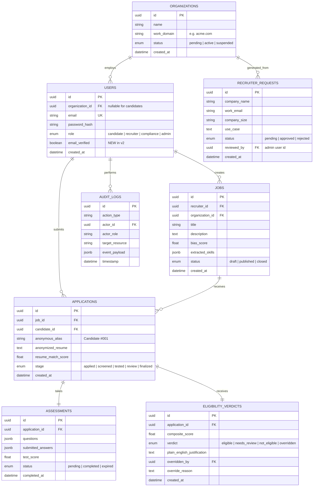

# 🌐 FairHire v2 — Production-Grade Website Architecture & Page Connection Map

> **FairHire v2** is an enterprise-grade, production-hardened AI recruitment platform designed to eliminate systemic bias across the hiring lifecycle. This document represents the **authoritative production blueprint** incorporating the corrected role & access model, hardened authentication flows, employer access vetting, hybrid multi-layer AI bias engine, complete database schema, and exhaustive page-to-page navigation maps.

---

## 📑 Table of Contents

1. [v1 Vulnerability Audit & v2 Production Fixes](#1-v1-vulnerability-audit--v2-production-fixes)
2. [Corrected Role Hierarchy & Access Security Model](#2-corrected-role-hierarchy--access-security-model)
3. [Complete Rebuilt Navigation & Page Connection Map](#3-complete-rebuilt-navigation--page-connection-map)
   - [3.1 Global System Navigation & Routing Flow](#31-global-system-navigation--routing-flow)
   - [3.2 Public Site & Onboarding Navigation Table](#32-public-site--onboarding-navigation-table)
   - [3.3 Recruiter Portal Navigation & Interconnections](#33-recruiter-portal-navigation--interconnections)
   - [3.4 Candidate Portal Navigation & Interconnections](#34-candidate-portal-navigation--interconnections)
   - [3.5 Admin Portal (Internal Non-Discoverable) Flow](#35-admin-portal-internal-non-discoverable-flow)
4. [Exhaustive Page-by-Page Content & Wireframe Specification](#4-exhaustive-page-by-page-content--wireframe-specification)
   - [Public Marketing & Access Pages](#41-public-marketing--access-pages)
     - [1. Rebuilt Landing Page (`/`)](#411-rebuilt-landing-page-)
     - [2. Split Login Page with Trust Visuals (`/login`)](#412-split-login-page-with-trust-visuals-login)
     - [3. Candidate Instant Registration (`/register/candidate`)](#413-candidate-instant-registration-registercandidate)
     - [4. Employer Access Request Portal (`/employers/request-access`)](#414-employer-access-request-portal-employersrequest-access)
     - [5. Candidate Email Verification Screen (`/verify-email`)](#415-candidate-email-verification-screen-verify-email)
     - [6. Recruiter Invite Password Setup (`/accept-invite`)](#416-recruiter-invite-password-setup-accept-invite)
     - [7. About Us & Legal Honesty (`/about`)](#417-about-us--legal-honesty-about)
     - [8. Features Deep Dive (`/features`)](#418-features-deep-dive-features)
     - [9. Contact & Enterprise Sales (`/contact`)](#419-contact--enterprise-sales-contact)
   - [Recruiter Portal Pages (`/recruiter/*`)](#42-recruiter-portal-pages-recruiter)
     - [10. Recruiter Layout & Global Navigation (`RecruiterLayout.jsx`)](#421-recruiter-layout--global-navigation-recruiterlayoutjsx)
     - [11. Command Center Dashboard (`/recruiter/dashboard`)](#422-command-center-dashboard-recruiterdashboard)
     - [12. Job Listings Management (`/recruiter/jobs`)](#423-job-listings-management-recruiterjobs)
     - [13. Job Creator & Hybrid Bias Scanner (`/recruiter/jobs/new`)](#424-job-creator--hybrid-bias-scanner-recruiterjobsnew)
     - [14. Blind Screening Candidates List (`/recruiter/candidates`)](#425-blind-screening-candidates-list-recruitercandidates)
     - [15. Human Review Queue (`/recruiter/review`)](#426-human-review-queue-recruiterreview)
     - [16. Detailed Question-by-Question Test Results (`/recruiter/test-results/:testId`)](#427-detailed-question-by-question-test-results-recruitertest-resultstestid)
     - [17. Compliance Audit Trail Explorer (`/recruiter/audit`)](#428-compliance-audit-trail-explorer-recruiteraudit)
   - [Candidate Portal Pages (`/candidate/*`)](#43-candidate-portal-pages-candidate)
     - [18. Candidate Layout & Navigation (`CandidateLayout.jsx`)](#431-candidate-layout--navigation-candidatelayoutjsx)
     - [19. Blind Job Board (`/candidate/jobs`)](#432-blind-job-board-candidatejobs)
     - [20. Resume Upload & PII Redaction (`/candidate/apply/:jobId`)](#433-resume-upload--pii-redaction-candidateapplyjobid)
     - [21. 30-Minute Timed Skill Assessment Engine (`/candidate/test/:testId`)](#434-30-minute-timed-skill-assessment-engine-candidatetesttestid)
     - [22. Application Status & Explainable Feedback (`/candidate/status`)](#435-application-status--explainable-feedback-candidatestatus)
   - [Internal Admin Portal (`/admin/*`)](#44-internal-admin-portal-admin)
     - [23. Employer Access Request Review Queue (`/admin/dashboard`)](#441-employer-access-request-review-queue-admindashboard)
5. [AI-Based Bias Detector — Hybrid Multi-Layer Feature Spec](#5-ai-based-bias-detector--hybrid-multi-layer-feature-spec)
   - [5.1 3-Layer Hybrid Architecture](#51-3-layer-hybrid-architecture)
   - [5.2 Bias Categories & Detection Signals](#52-bias-categories--detection-signals)
   - [5.3 Real-Time WebSocket & Deep Scan REST API Contracts](#53-real-time-websocket--deep-scan-rest-api-contracts)
   - [5.4 Mathematical Composite Score Formula](#54-mathematical-composite-score-formula)
   - [5.5 Structured LLM Rubric Prompt](#55-structured-llm-rubric-prompt)
   - [5.6 One-Click Replace Flow & Diff Hash Logging](#56-one-click-replace-flow--diff-hash-logging)
   - [5.7 Product Limitations & Legal Compliance](#57-product-limitations--legal-compliance)
6. [Updated Database Schema & ERD (Delta v1 $\rightarrow$ v2)](#6-updated-database-schema--erd-delta-v1--v2)
7. [Complete Production API Route Matrix](#7-complete-production-api-route-matrix)
8. [Reusable Frontend Components & UI Tokens](#8-reusable-frontend-components--ui-tokens)
9. [Production Hardening Checklist & Deployment](#9-production-hardening-checklist--deployment)

---

## 1. v1 Vulnerability Audit & v2 Production Fixes

| Problem in v1 | Real-World Security & Trust Risk | Production Fix in v2 |
|---|---|---|
| **Landing page had open `[I'm a Recruiter →]` button** that self-registered straight into `/recruiter/dashboard` | Anyone on the internet could create a recruiter account and view anonymous & private candidate data. | Recruiter signup goes to a **"Request Access"** form $\rightarrow$ Admin Review $\rightarrow$ Email invite $\rightarrow$ Account activated. |
| **Register success instantly logged recruiters into dashboard** | No email verification, no employer domain checks. | **Email verification + work domain match required** before any recruiter dashboard access. |
| **No Admin panel access control described** | Admin role existed in database but had no gated entry point. | Admin panel lives at a **non-discoverable route** (`/admin/*`), returns 404 to unauthorized users, and requires `role=admin` + re-auth step-up if session > 30m. |
| **Demo "Fill Demo Recruiter" button on login page** | Dangerous if shipped to production; exposes default credentials. | Strictly enclosed within `if (import.meta.env.DEV)` and **completely stripped from production bundle**. |
| **Single flat "Register" page with a role toggle** | Recruiter and Candidate represent fundamentally different trust levels. | Split into two distinct flows: `/register/candidate` (instant self-serve) and `/employers/request-access` (vetted enterprise intake). |
| **Login page was a plain form with no branding** | Weak first impression and low trust signal. | Rebuilt as a **split-screen layout (50/50)** with candid workplace photography and floating glassmorphism trust testimonials. |

---

## 2. Corrected Role Hierarchy & Access Security Model

```
                               ┌────────────────────────────────────────┐
                               │              PUBLIC SITE               │
                               │  Landing · About · Features · Pricing  │
                               └───────────────────┬────────────────────┘
                                                   │
                ┌──────────────────────────────────┼──────────────────────────────────┐
                │                                  │                                  │
                ▼                                  ▼                                  ▼
        "Find a Job"                  "Request Recruiter Access"                  "Sign In"
     (Candidate Signup —              (Organization Form — goes to             (Existing Users
     instant, self-serve)             admin queue, NOT instant)                     Only)
                │                                  │                                  │
                ▼                                  ▼                                  │
        Candidate Account                   Status: Pending                           │
      Created (Unverified)                         │                                  │
                │                                  ▼                                  │
                ▼                       Admin Reviews & Approves                      │
      Verification Email Sent                      │                                  │
                │                                  ▼                                  │
                ▼                     Invite Email w/ Signed Link                     │
     Candidate Clicks Link                         │                                  │
   (Account: email_verified=true)                  ▼                                  │
                │                       Recruiter Sets Password                       │
                ▼                    (Account: email_verified=true)                   │
         /candidate/jobs                           │                                  │
                                                   ▼                                  │
                                          /recruiter/dashboard ◄──────────────────────┘
```

### 2.1 Role Definitions
* **`candidate`**: Self-serve, email-verified, instant access to browse jobs, upload blind resume, take assessments, and view transparent feedback.
* **`recruiter` / `hr_lead`**: Requires organization request $\rightarrow$ admin approval $\rightarrow$ single-use 72-hour invited signup scoped to verified work domain (`@acme.com`).
* **`compliance`**: Invited only; read-mostly access to compliance audit trails and analytics without candidate override capabilities.
* **`admin`**: Invited only / seed-provisioned; manages employer vetting requests, organization provisioning, and system health. Never accessible via public links.

### 2.2 Production Auth Hardening Rules
1. **Email Verification Gate:** Both candidate and recruiter must have `email_verified=true` prior to session establishment.
2. **Invite Tokens:** Recruiter invite links are single-use, cryptographically signed, expire after 72 hours, and enforce email domain matching.
3. **Rate Limiting:** Strict IP & fingerprint rate limits on `/api/auth/login`, `/api/auth/register`, and `/api/employers/request-access`.
4. **Token Security:** Short-lived access token held in-memory + `httpOnly`, `Secure`, `SameSite=Strict` refresh cookie (No raw JWT in `localStorage`).
5. **Admin Step-Up Authentication:** Re-authentication required for admin actions if session age exceeds 30 minutes.
6. **Server-Side Route Enforcement:** Express middleware checks role on every `/recruiter/*` and `/admin/*` endpoint (client-side gating is UX-only).

---

## 3. Complete Rebuilt Navigation & Page Connection Map

### 3.1 Global System Navigation & Routing Flow

```mermaid
flowchart TD
    %% Public Routes
    Root["/ (Rebuilt Landing)"]
    Login["/login (Split Login)"]
    CandReg["/register/candidate (Candidate Signup)"]
    EmpReq["/employers/request-access (Employer Request)"]
    VerifyEmail["/verify-email?token=... (Email Verification)"]
    AcceptInvite["/accept-invite?token=... (Recruiter Invite)"]

    %% Recruiter Portal
    RecLayout["Recruiter Layout (Sidebar + Chatbot)"]
    RecDash["/recruiter/dashboard"]
    RecJobs["/recruiter/jobs"]
    RecJobNew["/recruiter/jobs/new (Hybrid Bias Scanner)"]
    RecJobEdit["/recruiter/jobs/:id/edit"]
    RecCand["/recruiter/candidates (Blind Screening)"]
    RecRev["/recruiter/review (Human Review Queue)"]
    RecTestRes["/recruiter/test-results/:testId"]
    RecAudit["/recruiter/audit (Audit Explorer)"]

    %% Candidate Portal
    CandLayout["Candidate Layout (Navbar + Chatbot)"]
    CandJobs["/candidate/jobs (Blind Job Board)"]
    CandApply["/candidate/apply/:jobId (PII Redaction)"]
    CandTest["/candidate/test/:testId (30-Min Timed Test)"]
    CandStatus["/candidate/status (Explainable Feedback)"]

    %% Admin Portal
    AdminDash["/admin/dashboard (Access Review Queue)"]

    %% Public Nav Connections
    Root -->|Click 'Sign In'| Login
    Root -->|Click 'Find a Job' (Primary)| CandReg
    Root -->|Click 'For Employers' (Secondary)| EmpReq
    
    CandReg -->|Submit Signup| VerifyEmail
    VerifyEmail -->|Email Link Clicked| CandJobs
    
    EmpReq -->|Submit Request| Root
    EmpReq -.->|Admin Approves in Background| AcceptInvite
    AcceptInvite -->|Set Password| RecDash

    Login -->|Recruiter Verified Login| RecDash
    Login -->|Candidate Verified Login| CandStatus
    Login -->|Admin Verified Login| AdminDash
    Login -->|Unverified Candidate| VerifyEmail

    %% Recruiter Internal Navigation
    RecLayout --> RecDash
    RecLayout --> RecJobs
    RecLayout --> RecCand
    RecLayout --> RecRev
    RecLayout --> RecAudit

    RecDash -->|Click 'Create Job'| RecJobNew
    RecDash -->|Click 'Active Jobs'| RecJobs
    RecDash -->|Click 'Needs Review'| RecRev
    RecDash -->|Click 'Audit Trail'| RecAudit
    RecJobs -->|Click 'Post Job'| RecJobNew
    RecJobs -->|Click 'Edit/Scan'| RecJobEdit
    RecJobs -->|Click 'Applicants'| RecCand
    RecJobNew -->|Score >= 70 & Publish| RecJobs
    RecJobEdit -->|Update Job| RecJobs
    RecCand -->|Click 'View Test'| RecTestRes
    RecCand -->|Click 'Review Candidate'| RecRev
    RecRev -->|Click 'Inspect Test'| RecTestRes
    RecRev -->|Submit Override| RecCand
    RecTestRes -->|Back Button| RecCand
    RecTestRes -->|Back Button| RecRev

    %% Candidate Internal Navigation
    CandLayout --> CandJobs
    CandLayout --> CandStatus

    CandJobs -->|Click 'Apply Blindly'| CandApply
    CandApply -->|Confirm & Submit CV| CandTest
    CandTest -->|Submit or Timer 00:00| CandStatus
    CandStatus -->|Click 'Start Test'| CandTest
    CandStatus -->|Click 'Browse Jobs'| CandJobs
```

---

### 3.2 Public Site & Onboarding Navigation Table

| Current Page / Screen | User Action / Trigger | Target Destination Page | Notes & Auth Enforcement |
|---|---|---|---|
| **Landing (`/`)** | Click `[Sign In]` (Navbar) | `/login` | Public |
| **Landing (`/`)** | Click `[Find a Job →]` (Hero Primary CTA) | `/register/candidate` | Direct self-serve candidate registration |
| **Landing (`/`)** | Click `[For Employers →]` (Hero Secondary CTA) | `/employers/request-access` | Intake request form (Not an instant account) |
| **Landing (`/`)** | Click `[Browse Open Roles]` | `/candidate/jobs` | Public viewing allowed; applying prompts candidate registration |
| **Candidate Signup (`/register/candidate`)** | Submit Form (Name, Email, Password) | `/verify-email` | Sends verification email with single-use link |
| **Verify Email (`/verify-email?token=`)** | Click link from email | `/candidate/jobs` | Sets `email_verified=true`, establishes session |
| **Employer Request (`/employers/request-access`)** | Submit Org Form (Company, Work Email, Size, Use Case) | Confirmation Screen on `/employers/request-access` | Writes to `RECRUITER_REQUESTS` table (`status=pending`) |
| **Admin Review (`/admin/dashboard`)** | Admin approves employer request | Generates Invite Token & Sends Email | Updates status to `approved`, creates `USERS` (`email_verified=false`) |
| **Recruiter Invite Link (`/accept-invite?token=`)** | Recruiter clicks email link & sets password | `/recruiter/dashboard` | Verifies domain match, sets `email_verified=true`, logs in |
| **Split Login (`/login`)** | Login as verified Recruiter | `/recruiter/dashboard` | Role detected automatically from account |
| **Split Login (`/login`)** | Login as verified Candidate | `/candidate/status` | Role detected automatically from account |
| **Split Login (`/login`)** | Login as Admin | `/admin/dashboard` | Non-discoverable admin console |
| **Split Login (`/login`)** | Login with unverified email | Blocked on `/login` | Shows banner: *"Please verify your email address to continue."* |

---

### 3.3 Recruiter Portal Navigation & Interconnections

| Recruiter Page | Action / Click Element | Connected Destination | Purpose & Data Carried |
|---|---|---|---|
| **Sidebar (Global)** | Click `Dashboard` | `/recruiter/dashboard` | Executive KPI overview & pipeline funnel |
| **Sidebar (Global)** | Click `Jobs` | `/recruiter/jobs` | View, edit, toggle job listings |
| **Sidebar (Global)** | Click `Candidates` | `/recruiter/candidates` | Anonymized applicant pool |
| **Sidebar (Global)** | Click `Review Queue` | `/recruiter/review` | Borderline (40%–69%) human decision queue |
| **Sidebar (Global)** | Click `Audit Trail` | `/recruiter/audit` | Regulatory event explorer & CSV download |
| **Sidebar (Global)** | Click `Logout` | `/` (Landing) | Clears session cookie & in-memory state |
| **Dashboard (`/recruiter/dashboard`)** | Click `[+ Create New Job]` | `/recruiter/jobs/new` | Opens JD editor with hybrid bias scanner |
| **Dashboard (`/recruiter/dashboard`)** | Click `Active Jobs` KPI Card | `/recruiter/jobs` | Filters to active postings |
| **Dashboard (`/recruiter/dashboard`)** | Click `Review Queue` KPI Card | `/recruiter/review` | Direct link to pending human reviews |
| **Jobs (`/recruiter/jobs`)** | Click `[+ Post New Job]` | `/recruiter/jobs/new` | Blank JD builder |
| **Jobs (`/recruiter/jobs`)** | Click `[Edit / Re-Scan]` | `/recruiter/jobs/:id/edit` | Loads existing JD for re-scanning |
| **Jobs (`/recruiter/jobs`)** | Click `[View Candidates (N)]` | `/recruiter/candidates?jobId=:id` | Filters candidate table by selected job |
| **Job Create (`/recruiter/jobs/new`)** | Click `[Publish Job]` (Score $\ge 70$) | `/recruiter/jobs` | Persists job, extracts skills, adds audit log |
| **Candidates (`/recruiter/candidates`)** | Click `[View Test Breakdown]` | `/recruiter/test-results/:testId` | Question-by-question scoring display |
| **Candidates (`/recruiter/candidates`)** | Click `[Override Verdict]` | Modal on `/recruiter/candidates` | Opens mandatory justification modal |
| **Candidates (`/recruiter/candidates`)** | Click `[View Redacted CV]` | Slide-Over Drawer on same page | Displays Spacy PII-stripped resume |
| **Review Queue (`/recruiter/review`)** | Click `[Inspect Test & Rubric]` | `/recruiter/test-results/:testId` | Evaluates technical short answer responses |
| **Review Queue (`/recruiter/review`)** | Click `[Approve / Reject]` | Modal on `/recruiter/review` | Enforces min 10-char written audit justification |
| **Test Results (`/recruiter/test-results/:testId`)** | Click `[← Back to Candidates]` | `/recruiter/candidates` | Returns to blind candidate roster |
| **Audit Trail (`/recruiter/audit`)** | Click `[📥 Export CSV]` | Triggers browser download | Streams `/api/audit/export-csv` file |

---

### 3.4 Candidate Portal Navigation & Interconnections

| Candidate Page | Action / Click Element | Connected Destination | Purpose & Data Carried |
|---|---|---|---|
| **Top Navbar (Global)** | Click `My Applications` | `/candidate/status` | Visual 4-stage tracking stepper |
| **Top Navbar (Global)** | Click `Browse Jobs` | `/candidate/jobs` | Open positions directory |
| **Top Navbar (Global)** | Click `Sign Out` | `/` (Landing) | Clears candidate session |
| **Job Board (`/candidate/jobs`)** | Click `[Apply Blindly →]` | `/candidate/apply/:jobId` | Opens resume upload dropzone for that role |
| **Job Board (`/candidate/jobs`)** | Click `[View Status]` (if applied) | `/candidate/status` | Jumps to existing application |
| **Apply (`/candidate/apply/:jobId`)** | Upload file & click `[Confirm & Apply]` | `/candidate/test/:testId` | Strips PII, extracts skills, generates test |
| **Take Test (`/candidate/test/:testId`)** | Click `[Submit Assessment]` | `/candidate/status` | Triggers rubric grading & redirects |
| **Take Test (`/candidate/test/:testId`)** | 30-Min Timer hits `00:00` | Auto-submits to `/candidate/status` | Submits existing answers to prevent timeout failure |
| **Status (`/candidate/status`)** | Click `[Start 30-Min Assessment]` | `/candidate/test/:testId` | Opens pending assessment |

---

### 3.5 Admin Portal (Internal Non-Discoverable) Flow

* **Route:** `/admin/dashboard`
* **Access Rules:** Requires `role=admin` and active verified session. Returns `404 Not Found` (never 403) to unauthenticated visitors to prevent endpoint discovery.

| Admin Action | Trigger Element | Resulting System State |
|---|---|---|
| **Review Employer Request** | View pending row in table | Inspects Company Name, Domain, Team Size, and Use Case |
| **Approve Request** | Click `[Approve & Invite]` | Creates `ORGANIZATIONS` record, creates `USERS` (`role=recruiter`, `email_verified=false`), generates signed 72h invite token, dispatches invitation email, logs `RECRUITER_REQUEST_APPROVED`. |
| **Reject Request** | Click `[Reject Request]` | Updates request status to `rejected`, dispatches polite notice email, logs `RECRUITER_REQUEST_REJECTED`. |

---

## 4. Exhaustive Page-by-Page Content & Wireframe Specification

---

### 4.1 Public Marketing & Access Pages

#### 4.1.1 Rebuilt Landing Page (`/`)
* **Visual Theme:** `#0B0F17` dark canvas, gradient brand accents, card borders `#262E42`. Real candid photography with dark gradient overlays.

##### Detailed Page Sections:
1. **Sticky Header / Navigation Bar:**
   - **Brand Logo:** `Fair`**`Hire`** with primary blue icon.
   - **Nav Links:** *Features*, *How Employers Get Access*, *Ethics & Compliance*, *About*.
   - **Action Buttons:**
     - `[Sign In]` (ghost button) $\rightarrow$ `/login`
     - `[Find a Job]` (primary filled button) $\rightarrow$ `/register/candidate`
2. **Hero Section (Split 55/45):**
   - **Left Column:**
     - Badge: `AI-Powered · Explainable · Fair`
     - Main Headline: *"Hire on merit. Eliminate bias."*
     - Sub-headline: *"Post verified de-biased job descriptions, screen candidates blindly with automated PII redaction, and evaluate technical capability through objective, rubric-graded assessments."*
     - **Dual CTA Button Group:**
       - `[Find a Job →]` (Primary filled button) $\rightarrow$ `/register/candidate`
       - `[For Employers →]` (Secondary outline button — visually conveys vetting process) $\rightarrow$ `/employers/request-access`
   - **Right Column (Imagery):**
     - Candid photography of a diverse engineering team collaborating over laptops, treated with a subtle `#0B0F17` dark gradient overlay blending seamlessly into the background canvas.
3. **Live Interactive Bias Scanner Teaser (Try Before Signup):**
   - Interactive typing box prefilled with sample text containing gender-coded and ageist phrasing.
   - Instant visual score ring updating in real time with replacement suggestions.
4. **"How Employers Get Access" 3-Step Trust Strip:**
   - Step 1: *1. Request Access* — Submit company details and hiring use-case.
   - Step 2: *2. We Verify Your Organization* — Work domain validation and anti-bias pledge.
   - Step 3: *3. Team Access Granted* — Secure, single-use invite sent to your hiring team.
   - *Purpose: Turns friction into an enterprise trust signal ("we vet every employer").*
5. **4 Core Value Proposition Cards (With Subtle Background Photo Textures):**
   - 🛡️ **Real-Time Hybrid Bias Detection:** Instant keystroke lexicon scanner backed by deep LLM analysis.
   - 🕶️ **Zero-PII Blind Screening:** Automated redaction of names, emails, phones, addresses, and demographic markers.
   - ⏱️ **Skill-Tailored Aptitude Assessments:** Auto-generated 10-question technical tests evaluated on a strict server-side rubric.
   - 📜 **Full Compliance Audit Trail:** Immutable records of every calculation, recruiter override, and timestamp with one-click CSV export.
6. **Platform Principles Checklist:**
   - ✅ *No demographic signals in scoring — only skills & merit*
   - ✅ *Every AI verdict explained in plain English*
   - ✅ *Recruiter override always possible, always logged*
   - ✅ *Borderline cases routed to human review, never auto-rejected*
7. **Social Proof Strip:**
   - Metrics: *"50,000+ Assessments Graded · 99.4% PII Redaction Accuracy · 100% Explainable Decisions"*.
8. **Footer:**
   - Legal disclaimer: *"FairHire reduces known categories of hiring bias. Software does not replace legal compliance obligations."*
   - Links to Privacy Policy, Terms of Service, GitHub Repository, Support.

---

#### 4.1.2 Split Login Page with Trust Visuals (`/login`)
* **Layout:** Split-screen (50/50 desktop, stacked 30/70 mobile).

##### Detailed Page Elements:
1. **Left Panel (Interactive Form):**
   - **Brand Logo:** `FairHire`
   - **Title:** *"Sign in to your account"*
   - **Form Fields:**
     - **Email Address:** `input[type="email"]` with auto-focus.
     - **Password:** `input[type="password"]` with show/hide password toggle.
     - *Note: Role is automatically detected from the database account upon authentication — no manual role switch tabs.*
   - **Action Button:**
     - `[Sign In →]` button (triggers `POST /api/auth/login`).
   - **Footer Navigation Links:**
     - *"Don't have an account? Find a job"* $\rightarrow$ `/register/candidate`
     - *"Employer?"* $\rightarrow$ `/employers/request-access`
   - **Development-Only Demo Quick-Fill Bar (Stripped in Production):**
     - Enclosed in `if (import.meta.env.DEV)`:
       - `[Fill Dev Recruiter]` | `[Fill Dev Candidate]` | `[Fill Dev Admin]`
2. **Right Panel (Full-Bleed Visual & Trust Card):**
   - High-resolution candid photograph of a candidate focused during a technical assessment.
   - Floating glassmorphic trust card with subtle backdrop blur:
     > *"Every decision explained. Every override logged. Hiring built on transparency."*

---

#### 4.1.3 Candidate Instant Registration (`/register/candidate`)
* **Layout:** Split-screen with candidate-focused visual.

##### Detailed Page Elements:
1. **Form Header:** *"Create your Candidate Account"*
2. **Subtitle:** *"Apply to top engineering roles with 100% blind screening."*
3. **Form Fields:**
   - **Full Name:** `input[type="text"]` (Used solely for account management; strictly hidden from recruiters).
   - **Email Address:** `input[type="email"]` (Requires verification).
   - **Password:** `input[type="password"]` (Min 8 characters, strength meter).
   - **Confirm Password:** `input[type="password"]`.
4. **Action Button:**
   - `[Create Candidate Account →]` $\rightarrow$ Calls `POST /api/auth/register` and redirects to `/verify-email`.
5. **Backlink:** *"Already have an account? Sign in"* $\rightarrow$ `/login`.

---

#### 4.1.4 Employer Access Request Portal (`/employers/request-access`)
* **Layout:** Split-screen with enterprise trust visual.

##### Detailed Page Elements:
1. **Form Header:** *"Request Recruiter Access"*
2. **Trust Banner:** *"To maintain a safe, fair ecosystem, every employer is vetted by our compliance team before access is granted."*
3. **Form Fields:**
   - **Company Name:** `input[type="text"]` (e.g. *Acme Technologies Inc.*).
   - **Work Email:** `input[type="email"]` (Must match company domain; free webmail addresses like `@gmail.com` are rejected).
   - **Company Size:** `select` (*1–50, 51–200, 201–1000, 1000+ employees*).
   - **Monthly Hiring Volume:** `select` (*1–5 roles, 5–20 roles, 20+ roles*).
   - **Hiring Use Case & Diversity Goals:** `textarea` (Brief description of recruiting objectives).
4. **Action Button:**
   - `[Submit Request for Review →]` $\rightarrow$ Calls `POST /api/employers/request-access`.
5. **Post-Submission Confirmation State:**
   - Success icon + message: *"Thank you! Our compliance team is reviewing your request. Approved organizations receive an email invitation within 1 business day."*

---

#### 4.1.5 Candidate Email Verification Screen (`/verify-email`)
* **Form Elements:**
  - Mail illustration + message: *"We've sent a verification link to your email address. Please click the link to activate your candidate account and start applying."*
  - `[Resend Verification Email]` button.

---

#### 4.1.6 Recruiter Invite Password Setup (`/accept-invite`)
* **Form Elements:**
  - Header: *"Welcome to FairHire at [Company Name]"*
  - Fields: Work Email (Pre-filled & read-only), Create Password, Confirm Password.
  - `[Activate Recruiter Account →]` button $\rightarrow$ Calls `POST /api/auth/accept-invite` and opens `/recruiter/dashboard`.

---

### 4.2 Recruiter Portal Pages (`/recruiter/*`)

#### 4.2.1 Recruiter Layout & Global Navigation (`RecruiterLayout.jsx`)
* **Sidebar (240px $\leftrightarrow$ 64px Collapsible):**
  - Brand Logo & collapse button.
  - Nav: 📊 Dashboard (`/recruiter/dashboard`), 💼 Jobs (`/recruiter/jobs`), 👥 Candidates (`/recruiter/candidates`), ⚠️ Review Queue (`/recruiter/review`), 📜 Audit Trail (`/recruiter/audit`).
  - User profile info & logout button.
* **Floating AI Assistant (`ChatbotWidget.jsx`):** Docked in bottom-right corner with recruiter-specific prompt pills.

---

#### 4.2.2 Command Center Dashboard (`/recruiter/dashboard`)
* **4 Metric KPI Cards:**
  - *Active Jobs Posted* (with average fairness rating) $\rightarrow$ `/recruiter/jobs`
  - *Total Applications Screened* $\rightarrow$ `/recruiter/candidates`
  - *Needs Human Review (Warning counter)* $\rightarrow$ `/recruiter/review`
  - *Overall Organization Bias Rating* (Animated score ring)
* **Pipeline Funnel Progress Bars:**
  - `Applied → Screened → Tested → Eligible → Hired`
* **Recent Activity & Review Queue Quick Links:** Table of latest candidate assessments.

---

#### 4.2.3 Job Listings Management (`/recruiter/jobs`)
* **Header:** Search bar, filter by department, `[+ Post New Job]` button $\rightarrow$ `/recruiter/jobs/new`.
* **Job Cards Grid:** Title, department, date created, fairness badge (`94% - De-biased`), extracted skill tags, applicant count, `[View Applicants]` button $\rightarrow$ `/recruiter/candidates?jobId=:id`, `[Edit/Scan]` button $\rightarrow$ `/recruiter/jobs/:id/edit`.

---

#### 4.2.4 Job Creator & Hybrid Bias Scanner (`/recruiter/jobs/new`)
* **Left Column (Form & Rich Editor):**
  - Job Title, Department, Location, Experience Level.
  - **Job Description Rich Textarea:** Debounced keystrokes streamed over WebSocket `/ws/bias-score`.
  - Extracted Technical Skills container dynamically populated as you type.
* **Right Column (Hybrid Bias Analysis Engine):**
  - **Animated SVG Score Ring (`BiasScoreRing.jsx`):** Real-time composite score (0–100).
  - **Bias Flag Panel (`BiasFlagPanel.jsx`):** Categorized chips (Gender-coded, Ageist, Pedigree, Ability, Structural).
  - **One-Click Replacements:** Click any suggestion chip to instantly replace words in the textarea.
  - **`[Deep Scan]` Button:** Triggers Layer 2 LLM analysis for tone and structural review.
* **Enforced Safety Guardrail:** `[Publish Job]` button locked until score $\ge 70$.

---

#### 4.2.5 Blind Screening Candidates List (`/recruiter/candidates`)
* **Header Controls:** Job selector dropdown, Stage filter pills (*All, Applied, Screened, Tested, Needs Review, Eligible, Rejected*).
* **Blind Candidate Roster:**
  - Candidate Alias (`Candidate #001`, `Candidate #002` — all PII hidden).
  - Resume Match Bar, Assessment Score Bar, Composite Score.
  - Status badges: `Eligible`, `Needs Review`, `Not Eligible`, `Overridden`.
  - Actions: `[View Test Breakdown]` $\rightarrow$ `/recruiter/test-results/:testId`, `[View Redacted CV]`, `[Override Verdict]` modal.

---

#### 4.2.6 Human Review Queue (`/recruiter/review`)
* **Dedicated Queue for Borderline Scores (40%–69%):**
  - Side-by-side display: Candidate skills vs test response excerpts.
  - Plain-English AI verdict justification.
  - `[Inspect Full Test]` $\rightarrow$ `/recruiter/test-results/:testId`.
  - `[Promote to Eligible]` / `[Mark Not Eligible]` buttons $\rightarrow$ Opens Override Modal requiring minimum 10-character written rationale.

---

#### 4.2.7 Detailed Question-by-Question Test Results (`/recruiter/test-results/:testId`)
* **Candidate Header:** `Candidate #00X`, Applied Role, Overall Test Score Ring.
* **Section 1: 8 Multiple Choice Questions:** Prompt, candidate's selected choice, correct indicator, score (1/1 or 0/1).
* **Section 2: 2 Technical Short Answers:** Scenario prompt, candidate's response, rubric keywords matched, automated feedback note.
* **Actions:** `[← Back to Candidates]`, `[Override Verdict]`.

---

#### 4.2.8 Compliance Audit Trail Explorer (`/recruiter/audit`)
* **Top Controls:** Search bar, date range picker, action type filter dropdown (`JOB_PUBLISHED`, `ELIGIBILITY_OVERRIDDEN`, `RECRUITER_REQUEST_APPROVED`, etc.), `[📥 Export CSV Report]` button.
* **Audit Table:** Timestamp, Action Type badge, Actor Role & ID, Target Resource ID, Summary.
* **Expandable JSON Payload Viewer:** Displays cryptographic parameters, previous scores, override reasons.

---

### 4.3 Candidate Portal Pages (`/candidate/*`)

#### 4.3.1 Candidate Layout & Navigation (`CandidateLayout.jsx`)
* **Top Navbar:** `FairHire` logo, 📋 `My Applications` (`/candidate/status`), 💼 `Browse Jobs` (`/candidate/jobs`), Candidate Email, `[Sign Out]`.
* **Floating Candidate AI Assistant (`ChatbotWidget.jsx`):** Candidate FAQ chips on blind screening and test rules.

---

#### 4.3.2 Blind Job Board (`/candidate/jobs`)
* **Search & Filter:** Keyword search, department filter.
* **Job Cards:** Title, department, location, required skill tags, 🛡️ *Verified Bias-Free Listing* badge.
* **Action:** `[Apply Blindly →]` $\rightarrow$ `/candidate/apply/:jobId`.

---

#### 4.3.3 Resume Upload & PII Redaction (`/candidate/apply/:jobId`)
* **Step 1:** File dropzone for PDF, DOCX, TXT.
* **Step 2:** Live PII redaction preview (Shows Name, Email, Phone, Address redacted, while skills and experience are preserved in green).
* **Step 3:** Consent checkbox & `[Confirm & Apply]` button $\rightarrow$ Navigates to `/candidate/test/:testId`.

---

#### 4.3.4 30-Minute Timed Skill Assessment Engine (`/candidate/test/:testId`)
* **Top Bar:** Role Title, Question Progress (*"Question 4 of 10"*), Animated 30-Minute Countdown Clock (Turns red under 5 mins, auto-submits at 00:00).
* **Question Card:**
  - Questions 1–8: Multiple Choice radio selections.
  - Questions 9–10: Technical Short Answer rich textarea.
* **Question Matrix Dot-Grid (Right Sidebar):** 10 numbered indicators (Gray = Unanswered, Green = Answered, Yellow = Flagged).
* **Controls:** `[Previous]`, `[Flag for Review]`, `[Next]`, `[Submit Assessment]`.

---

#### 4.3.5 Application Status & Explainable Feedback (`/candidate/status`)
* **4-Stage Visual Stepper:**
  1. `Resume Uploaded & Anonymized` (Completed)
  2. `Skills Assessment` (Pending / Completed)
  3. `Objective Evaluation` (In Progress)
  4. `Final Decision` (Eligible / Needs Review / Not a Match)
* **Pending Test Banner:** `[Start 30-Min Assessment →]` $\rightarrow$ `/candidate/test/:testId`.
* **Decision Card:** Plain-English justification explaining candidate strengths and rubric matching with zero demographic factors.

---

### 4.4 Internal Admin Portal (`/admin/*`)

#### 4.4.1 Employer Access Request Review Queue (`/admin/dashboard`)
* **Header:** *"Employer Access Requests (Pending Review)"*
* **Table Columns:** Company Name, Work Email & Domain, Company Size, Use Case Summary, Requested Date, Actions (`[Approve & Send Invite]`, `[Reject]`).

---

## 5. AI-Based Bias Detector — Hybrid Multi-Layer Feature Spec

### 5.1 3-Layer Hybrid Architecture

```
┌──────────────────────────────────────────────┐
│       JobCreate.jsx (Rich Textarea)          │
└──────────────────────┬───────────────────────┘
                       │ Debounced (600ms) over WebSocket
                       ▼
┌──────────────────────────────────────────────┐
│         /ws/bias-score (Node.js Relay)       │
└──────────────────────┬───────────────────────┘
                       │
                       ▼
┌──────────────────────────────────────────────────────────────────┐
│                 Python FastAPI AI Microservice                   │
│                                                                  │
│  Layer 1 — Lexicon Scanner (Instant / <50ms)                     │
│  - Runs on every keystroke event                                 │
│  - Regex / word-boundary match against curated dictionary        │
│  - Returns provisional score and instant flag chips              │
│                                                                  │
│  Layer 2 — LLM Analysis (On-Demand / 1–3s)                       │
│  - Triggered on 2s pause or explicit "Deep Scan" click           │
│  - Structured prompt sent to Claude with fixed rubric            │
│  - Detects subtext, structural bias, and rewrite suggestions     │
│                                                                  │
│  Layer 3 — Score Merge & Redis Cache                             │
│  - Merges L1 + L2 flags, dedupes overlapping spans               │
│  - Computes composite bias score (0–100)                         │
│  - Caches by text SHA-256 hash (re-scanning unchanged text is $0)│
└──────────────────────────────────────────────────────────────────┘
```

#### Why Two Layers:
| Metric / Feature | Layer 1 (Lexicon) | Layer 2 (LLM Analysis) |
|---|---|---|
| **Latency** | $< 50\text{ms}$ | $1–3\text{s}$ |
| **Cost** | Free ($0) | Minor per-call LLM cost |
| **What it Catches** | Known bad words/phrases | Tone, subtext, structural bias, inflated requirements |
| **Consistency** | 100% deterministic | Temperature 0 deterministic rubric |
| **Role in UI** | Live keystroke feedback (`BiasFlagPanel`) | "Deep Scan" pass & final gate unlocking `[Publish Job]` |

---

### 5.2 Bias Categories & Detection Signals

| Category | Examples Flagged | Detection Engine |
|---|---|---|
| **Gender-Coded Language** | *"rockstar", "ninja", "dominant", "nurturing", "empathetic"* (when framed as a role demand) | Lexicon + LLM |
| **Age Bias** | *"young", "energetic", "digital native", "recent graduate only", "X+ years max"* | Lexicon + LLM |
| **Pedigree / Exclusion Bias** | *"Ivy League only", "top-tier university", "native English speaker"* | Lexicon + LLM |
| **Ability / Disability Bias** | *"must be able to stand for 8 hours"* (irrelevant to desk roles), *"no accommodations"* | LLM Only |
| **Cultural / Appearance Bias** | *"professional appearance", "culture fit"* used vaguely | LLM Only |
| **Structural Red Flags** | Inflated requirements (e.g. *"10+ years experience for Junior Developer"*) | LLM Only |

---

### 5.3 Real-Time WebSocket & Deep Scan REST API Contracts

#### Layer 1 (Real-Time WebSocket)
```json
// Client -> Server
{ "type": "scan", "jobId": "draft_123", "text": "We need a rockstar developer...", "cursor": 34 }

// Server -> Client
{
  "type": "flags_partial",
  "flags": [
    {
      "id": "f1",
      "term": "rockstar",
      "category": "gender_coded",
      "start": 12,
      "end": 20,
      "suggestion": "skilled fullstack developer",
      "severity": "medium"
    }
  ],
  "provisional_score": 68
}
```

#### Layer 2 (Deep Scan REST: `POST /scan-bias`)
```json
// Request
{
  "job_id": "draft_123",
  "text": "We are seeking a rockstar developer for our young and energetic team...",
  "role_title": "Senior Software Engineer"
}

// Response
{
  "score": 58,
  "rating": "moderate_bias",
  "flags": [
    {
      "id": "f1",
      "phrase": "rockstar developer",
      "category": "gender_coded",
      "explanation": "Masculine-coded, aggressive framing linked to lower application rates from female engineers.",
      "suggestion": "skilled software engineer",
      "severity": "high",
      "source": "llm"
    },
    {
      "id": "f2",
      "phrase": "young and energetic team",
      "category": "age_bias",
      "explanation": "Implies preference for younger candidates, violating age discrimination guidelines.",
      "suggestion": "collaborative, driven team",
      "severity": "high",
      "source": "lexicon"
    }
  ],
  "structural_notes": [
    "Requirement of '10+ years experience' for a Senior role is inflated relative to market benchmarks."
  ],
  "model": "claude-3-5-haiku",
  "cached": false
}
```

---

### 5.4 Mathematical Composite Score Formula

$$\text{Score} = 100 - \left(\sum \text{severity\_weight}\right) - \text{structural\_penalty}$$

* **Severity Weights:** `high = 8`, `medium = 4`, `low = 2`
* **Category Cap:** Maximum $20$ points deducted per single category (prevents a single repeated term from unfairly destroying a score).
* **Structural Penalty:** $0–10$ points derived from structural notes count.
* **Thresholds:**
  - $0–39 \implies \text{High Bias (Danger)}$
  - $40–69 \implies \text{Moderate Bias (Warning)}$
  - $70–100 \implies \text{Fair \& Inclusive (Required to Publish)}$

---

### 5.5 Structured LLM Rubric Prompt

```
You are a hiring-bias auditor. Analyze the job description text and return ONLY valid JSON matching this schema:
{ "score": number, "rating": string, "flags": [], "structural_notes": [] }

Rules:
- Flag only text that appears verbatim in the input; include exact character offsets.
- Categories allowed: gender_coded, age_bias, pedigree_bias, ability_bias, cultural_bias, structural_red_flag.
- For each flag, give a one-sentence, plain-English explanation and one concrete neutral rewrite suggestion.
- Do not flag legitimate job requirements (e.g. "must be able to lift 50lbs" for a warehouse role is a bona fide occupational requirement). Only flag when irrelevant to the role or phrased in an exclusionary way.
- Be conservative: do not manufacture bias where none exists. A clean JD should score 90+.
- Return no prose outside the JSON object.
```

---

### 5.6 One-Click Replace Flow & Diff Hash Logging

1. User clicks a flagged chip in `BiasFlagPanel`.
2. Frontend replaces `text[start:end]` with `flag.suggestion` in the textarea.
3. Triggers an automatic debounced re-scan so the score updates live.
4. An audit record is created: `BIAS_SUGGESTION_ACCEPTED` logging the category and a SHA-256 diff hash (avoids storing raw JD text that may accidentally contain pasted PII).

---

### 5.7 Product Limitations & Legal Compliance
* The software **reduces** known categories of bias; it does not claim to legally "eliminate" all liability.
* All public and documentation copy uses the phrase *"reduces hiring bias"* for regulatory compliance.
* Recruiters can use the *"Dismiss Flag"* button if a term represents a bona fide occupational qualification.

---

## 6. Updated Database Schema & ERD (Delta v1 $\rightarrow$ v2)



---

## 7. Complete Production API Route Matrix

| Endpoint | Method | Role Required | Description |
|---|---|---|---|
| `/api/auth/register` | `POST` | Public | Register new candidate account |
| `/api/auth/verify-email` | `GET` | Public | Verify candidate email token |
| `/api/employers/request-access` | `POST` | Public (Rate-limited) | Submit organization recruiter intake request |
| `/api/auth/accept-invite` | `POST` | Public (Signed Token) | Recruiter password setup from invite email |
| `/api/auth/login` | `POST` | Public (Rate-limited) | Authenticate user & issue httpOnly cookie |
| `/api/auth/refresh` | `POST` | Public (Cookie) | Issue new short-lived access token |
| `/api/auth/me` | `GET` | Authenticated | Retrieve current user profile & role |
| `/api/admin/recruiter-requests` | `GET` | `admin` | List pending employer access requests |
| `/api/admin/recruiter-requests/:id/decision` | `POST` | `admin` | Approve or reject employer request |
| `/api/jobs` | `GET` | Public | List published job openings |
| `/api/jobs` | `POST` | `recruiter` | Create and publish de-biased job (Score $\ge 70$) |
| `/api/applications` | `POST` | `candidate` | Upload resume & apply (with Spacy NER PII strip) |
| `/api/assessments/generate` | `POST` | `candidate` | Generate 10-question dynamic assessment |
| `/api/assessments/submit` | `POST` | `candidate` | Submit answers for automated rubric grading |
| `/api/eligibility/override` | `POST` | `recruiter` | Recruiter manual override with mandatory written rationale |
| `/api/audit/logs` | `GET` | `recruiter`, `compliance`, `admin` | Query and filter compliance audit trail |
| `/api/audit/export-csv` | `GET` | `recruiter`, `compliance`, `admin` | Download audit log as CSV |
| `/ws/bias-score` | `WS` | `recruiter` | WebSocket for sub-50ms live JD bias scoring |

---

## 8. Reusable Frontend Components & UI Tokens

### UI Color Tokens (Kept Exactly As Specified)

```css
:root {
  /* Surfaces */
  --color-bg: #0B0F17;              /* Deep canvas background */
  --color-surface: #131826;         /* Primary cards and panels */
  --color-surface-alt: #1B2233;     /* Nested cards and hover states */
  --color-border: #262E42;          /* Subtle dividing borders */

  /* Text */
  --color-text-primary: #F4F6FB;
  --color-text-secondary: #9AA4BF;
  --color-text-muted: #626C87;

  /* Brand Accents */
  --color-primary: #5B7FFF;         /* Primary brand buttons and links */
  --color-primary-hover: #4A6BE0;
  --color-accent: #7C5CFF;          /* AI features and Chatbot highlights */

  /* Status Colors */
  --color-success: #34C77B;         /* Eligible / Low Bias */
  --color-warning: #F5B93D;         /* Needs Review / Moderate Bias */
  --color-danger:  #F0554C;         /* Not Eligible / High Bias */
}
```

### Component Directory

| Component | Path | Features |
|---|---|---|
| `<BiasScoreRing />` | `src/components/BiasScoreRing.jsx` | Animated circular SVG with dynamic stroke transition across 3 thresholds. |
| `<BiasFlagPanel />` | `src/components/BiasFlagPanel.jsx` | Categorized chip list of detected bias flags with one-click replacements and dismiss options. |
| `<ChatbotWidget />` | `src/components/ChatbotWidget.jsx` | Role-aware AI assistant with pre-canned suggestion chips and markdown parsing. |
| `<ErrorBoundary />` | `src/components/ErrorBoundary.jsx` | Production-grade React error boundary. |
| `<AuthContext />` | `src/context/AuthContext.jsx` | In-memory token management, httpOnly refresh flow, and role-based permissions. |

---

## 9. Production Hardening Checklist & Deployment

### Production Build Checklist
- [x] Strip demo credentials & prefill buttons from production build (`import.meta.env.DEV` guard).
- [x] Move JWT storage from raw `localStorage` to short-lived in-memory token + `httpOnly` refresh cookie.
- [x] Enforce server-side role middleware on all `/recruiter/*` and `/admin/*` API endpoints.
- [x] Admin route (`/admin/*`) returns `404 Not Found` to unauthorized requests to prevent endpoint probing.
- [x] Rate limiting enabled on `/api/employers/request-access` and `/api/auth/register`.
- [x] Work domain validation enforced on recruiter invite links.
- [x] Audit logs record all admin approval/rejection and bias suggestion acceptance actions.

### Docker Multi-Container Deployment

```powershell
# 1. Clone repository
git clone https://github.com/pateladil910/AI-Hiring-Bias-Detector.git
cd AI-Hiring-Bias-Detector

# 2. Configure Environment
cp .env.example .env

# 3. Launch Production Ecosystem (All 5 Services)
docker-compose up --build
```

---

*Documentation maintained by FairHire Core Engineering Team.*
