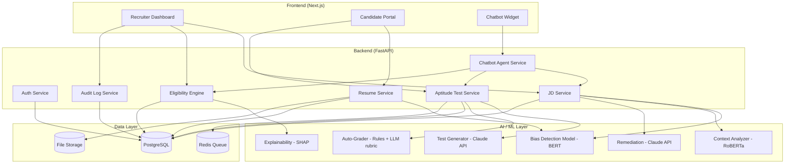
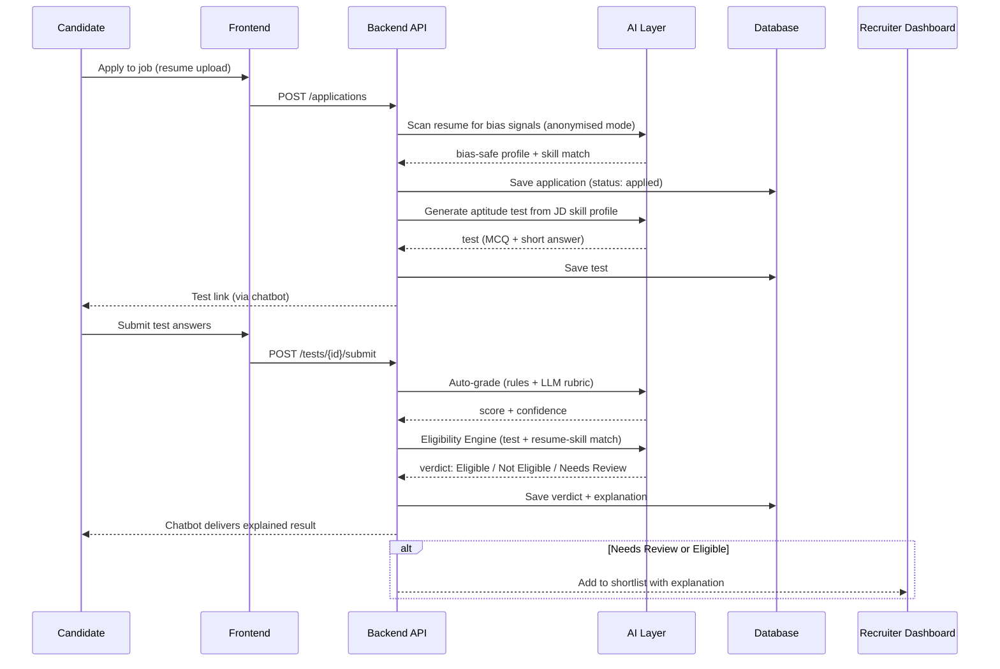

# architecture.md — AI Hiring Bias Detector & Fair Hiring Pipeline

## 1. Tech Stack

| Layer | Technology | Notes |
|---|---|---|
| Frontend | Next.js 14 (App Router) + TypeScript | SSR + client components for real-time score UI |
| Styling | Tailwind CSS + shadcn/ui | Design tokens defined in `design.md` |
| Backend API | FastAPI (Python 3.12) | Async, auto-generated OpenAPI docs |
| AI / NLP | HuggingFace Transformers (BERT/RoBERTa) + Claude API | Bias detection + remediation + chatbot + test generation |
| Realtime | WebSockets (FastAPI native) | Live bias score, live test timer, chatbot streaming |
| Database | PostgreSQL 16 + pgvector | Relational data + embeddings for benchmarking |
| Cache / Queue | Redis + Celery | Async AI jobs (grading, test generation, resume parsing) |
| File Storage | Local disk (dev) → S3-compatible (prod-style) | Resumes, JD files, reports |
| Auth | JWT-based auth, simple RBAC | Roles: Admin, HR Lead, Recruiter, Compliance, Candidate |
| Chatbot Agent | Claude API with tool-calling | Same backend endpoints as the dashboard — no separate logic |
| Monitoring (optional) | Basic logging + Sentry (optional) | Kept lightweight for a student project |

> Kept intentionally simpler than the original roadmap's enterprise stack (no Auth0/Datadog/AWS
> ECS/Terraform requirement) — same architecture *shape*, sized for a solo/duo student build.

---

## 2. High-Level System Diagram



---

## 3. Candidate Pipeline Data Flow



---

## 4. Folder Structure

```
ai-hiring-bias-detector/
├── frontend/                          # Next.js app
│   ├── app/
│   │   ├── (recruiter)/
│   │   │   ├── dashboard/             # Executive dashboard, KPIs
│   │   │   ├── jobs/                  # JD create/edit + live bias score
│   │   │   ├── candidates/            # Shortlist, review queue
│   │   │   └── audit/                 # Audit trail viewer
│   │   ├── (candidate)/
│   │   │   ├── apply/[jobId]/         # Application form
│   │   │   ├── test/[testId]/         # Aptitude test UI
│   │   │   └── status/                # Application status tracker
│   │   ├── (auth)/                    # Login/register
│   │   └── layout.tsx
│   ├── components/
│   │   ├── ui/                        # shadcn/ui primitives
│   │   ├── bias-score/                # Score ring, heat-map overlay
│   │   ├── chatbot/                   # Chat widget (candidate + recruiter copilot)
│   │   └── charts/                    # KPI/trend charts
│   ├── lib/                           # API client, hooks, utils
│   └── styles/                        # Tailwind config, design tokens
│
├── backend/                           # FastAPI app
│   ├── app/
│   │   ├── api/v1/
│   │   │   ├── jobs.py
│   │   │   ├── resumes.py
│   │   │   ├── tests.py
│   │   │   ├── eligibility.py
│   │   │   ├── chatbot.py
│   │   │   └── audit.py
│   │   ├── services/
│   │   │   ├── bias_detection.py
│   │   │   ├── test_generator.py
│   │   │   ├── grading.py
│   │   │   ├── eligibility_engine.py
│   │   │   └── chatbot_agent.py
│   │   ├── models/                    # SQLAlchemy models
│   │   ├── schemas/                   # Pydantic schemas
│   │   ├── core/                      # config, security, auth
│   │   └── main.py
│   ├── ml/
│   │   ├── bias_model/                # fine-tuned BERT artifacts
│   │   ├── explainability/            # SHAP wrappers
│   │   └── prompts/                   # Claude prompt templates (remediation, test-gen, chatbot)
│   └── tests/                         # pytest suite
│
├── docs/                              # prd.md, architecture.md, rules.md, etc. (this set)
└── docker-compose.yml
```

---

## 5. Key Data Models (simplified)

```
users(id, email, role, org_id, created_at)
organisations(id, name)
jobs(id, org_id, title, raw_text, bias_score, skill_profile_json, status, created_by)
applications(id, job_id, candidate_id, resume_url, anonymised_text, resume_bias_score, status)
tests(id, job_id, application_id, questions_json, generated_from_skill_profile)
test_submissions(id, test_id, answers_json, auto_score, llm_confidence)
eligibility_verdicts(id, application_id, verdict, explanation, model_version, created_at)
audit_logs(id, org_id, user_id, action, entity_type, entity_id, reason, timestamp)
chatbot_sessions(id, user_id, role, messages_json, created_at)
```

---

## 6. AI Agent Chatbot — Tool-Calling Design

The chatbot is **not** a separate rules engine — it's a conversational layer that calls the same
backend endpoints as the UI, via tool-calling:

| Tool | Backend endpoint | Used by |
|---|---|---|
| `get_job_status` | `GET /jobs/{id}` | Recruiter |
| `create_job_bias_check` | `POST /jobs/{id}/analyze` | Recruiter |
| `send_test_link` | `POST /tests/{id}/notify` | Candidate |
| `get_application_status` | `GET /applications/{id}` | Candidate |
| `summarize_shortlist` | `GET /jobs/{id}/shortlist` | Recruiter |
| `schedule_interview` | `POST /interviews` | Both |
| `explain_verdict` | `GET /eligibility/{id}/explanation` | Candidate + Recruiter |

This keeps a single source of truth: the chatbot can never make a decision the dashboard
doesn't already know about, and vice versa.
